# breaking down barriers 系列
## 01 什么是"barriers"
在D3D12或Vulkan编程里花费大量的时间精力才能正确配置 barriers，让渲染程序正确运行。当驱动更新时，或者当修改渲染代码时，检测层总是会报出一些问题。硬件厂商也提醒我们要正确使用 "barriers" 才能提升性能。
### barrier 详解
在多线程编程领域，"barrier"被当做同步点，既所有的线程运行到对应的点然后停止。
``` c++
void ThreadFunction()
{
    DoStuff();
 
    // Wait for all threads to hit the barrier
    barrier.Wait();
 
    // We now know that all threads called DoStuff()
}
```
通过此方法，我们可以确认所有线程都完成了自己的任务，或者是后续的程序要读取前面线程执行的内容。我们可以通过原子操作，遍历一个变量的变化来实现一个线程的barrier，或者可以通过信号和条件变量判定线程在等待状态时，让线程sleep。

在其他情况下，“barrier”指的是内存barrier（或者叫篱笆（fence））。内存barrier用来保证内存操作在barrier前或后完成。
``` c++
// DataIsReady and Data are written to
// by a different thread
if(DataIsReady)
{
    // Make sure that reading Data happens
    // *after* reading from DataIsReady
    MemoryBarrier();
 
    DoSomething(Data);
}
```
这两种情况的barrier所指不同，但他们的共同点是：
* 前面的产生内容，后面的需要读取产生的内容
* 后一个任务依赖前一个任务的完成，比如在运行时计算一个数组的索引，然后再读取数组内容

在编译时就知道依赖顺序时，编译器保证了执行顺序。但是当多线程共同读写数据时，编译器无法保证先后顺序，或者不同硬件读写内存时。这时使用barrier使得执行顺序得到保证。

由于编译器不能自动处理多线程编程的依赖关系，建立一个[依赖图](https://en.wikipedia.org/wiki/Dependency_graph)来说明当前任务依赖其它任务产生的结果。通过依赖图，就可以清晰的决定所有任务的执行顺序，并且知道该在何处插入对应的同步点，在两个（多个任务）任务之间，来确保前置任务完成，再执行后续的任务。这里有一个容易理解的例子[ Intel’s documentation for Thread Building Blocks](https://software.intel.com/en-us/node/517349):  
<p align="center">

</p>
通过我们的生活常识即可很好的理解整个制作汉堡的流程顺序，在多线程编程中如果不注意执行顺序，很容易出现问题。


为了避免这种问题的发生，任务调度程序强制一个任务（任务组）等待，只到前一个任务（任务组）完成执行。这种机制称作barrier或者同步点：

<p align="center">

</p>

这种类型的同步很容易在当前cpu架构上实现，有很多灵活又强大的工具可供选择：原子操作，初级同步（synchronization primitives），系统级条件变量，其它等等。

### 回到gpu方面
使用性能分析工具[Radeon GPU Profiler](https://gpuopen.com/gaming-product/radeon-gpu-profiler-rgp/)截取一帧实例工程[Deferred Texturing sample](https://github.com/TheRealMJP/DeferredTexturing)，如下图：
<p align="center">

</p>
左边为 `draw call`，右边蓝色条显示 `draw call` 的起始和终止。如图所示这里有很多并行运行的情况。

使用另外一个工具[PIX for windows](https://blogs.msdn.microsoft.com/pix/download/)，如图所示：
<p align="center">

</p>
如图所示，绘画指令依然是并行执行。

GPU有成百上千的核心（shader core）来并行处理任务。并且为了最大效能发挥核心作用，不同状态之间的任务也会并行处理。但是并行状态之间的任务如果有前后依赖关系，那就需要在CPU端插入“barrier”，使得后面的任务正确的使用前面任务的结果。这种同步等待的方式也称作“flush” 或者 “wait for idle”。

### 缓存很难
x86架构下，CPU每个核心有自己的L1缓存，共享L2和L3缓存，当访问相同位置的内存地址时，CPU确保缓存是[对齐](https://en.wikipedia.org/wiki/Cache_coherence)的。

GPU的缓存不像CPU有严格的层级关系，没有公开资料表明GPU缓存到底如何设计，通过一个AMD的分享[slider](http://32ipi028l5q82yhj72224m8j.wpengine.netdna-cdn.com/wp-content/uploads/2016/03/GDC_2016_D3D12_Right_On_Queue_final.pdf)，可以看出部分问题。

<p align="center">

</p>
由于显卡缓存的结构，会导致缓存不对齐问题，因此在做“写-读”操作时需要“barrier”去同步缓存。

### 压缩更多的带宽
由于分辨率的提高，数据量非常大。比如4k渲染一帧缓存有8294400像素，如果没有重绘的话。每个像素包含16bit 浮点数，rgba格式每个像素需要8bytes空间。大概需要64M空间，如果G-buffer，还要多四五倍。如果还有MSAA，有需要更多的空间。这对于带宽压力很大。

为了减缓带宽压力，GPU设计者发明了硬件无损压缩，通常这个组件包含在光栅化输出管线（ROP->Raster Operations Pipeline）。用在写渲染目标（render target）和深度缓存（depth buffers）。[AMD](https://gpuopen.com/dcc-overview/) 和 [Nvidia](https://www.anandtech.com/show/10325/the-nvidia-geforce-gtx-1080-and-1070-founders-edition-review/8)使用它们算法，可以将像素组按 `2:1` 到 `8:1` 区间压缩，节省大量的带宽。

<p algin="center">

</p>

当shader需要读取或者写内容时，需要解压器将内容解压为原始内容，这里就需要“barrier”同步。

### D3D 如何使用“barrier”
D3D12或者Vulkan没有直接操作“barrier”的api。D3D12和Vulkan对应的“barrier” api 有更高等级的抽象。主要瞄准数据在不同的渲染阶段的流动。另一种方式是通知任务或者功能单元数据的可见性。通过这种方式告诉驱动，资源的过去和将来，这是决定是否要刷新缓存或解压数据的必要信息。线程同步也通过状态变化，而不是依赖绘制或批次(draw or dispatch)的顺序。

D3D11通过查看绑定的输入输出资源，指出啥时候需要可见性变化（比如从一个渲染目标变为shader 输入变量），然后自动插入同步点，刷新缓存，解压数据这些步骤。这些都是自动完成，但是有以下缺点：

* 自动追踪资源以及绘制/批次调用非常昂贵
* 并行生成命令缓存（command buffer）非常困难，因为不同线程之间不能确定资源的生命周期（比如在一个线程设置图片为渲染目标，另一个作为输入参数）
* 它依赖显示资源绑定模型，上下文知道整个绘制或批次输入和输出参数，没有办法使用非绑定资源工作
* 在一些情况下驱动插入非必须的“barriers”，因为不清楚shader访问数据的方式。比如两个批次增加同一个原子计数器，没必要加“barriers”。

D3D12和Vulan背后思考的就是通过应用（app）向驱动提供必要的可见性变化去消除这些缺点。这种方式简化了驱动，让应用自己设置合理的“barriers”。如果你的渲染设置是固定的，只需要将“barriers”硬编码并且几乎CPU零消耗。或者你可以实现引擎功能，[建立自己的依赖树](https://www.ea.com/frostbite/news/framegraph-extensible-rendering-architecture-in-frostbite)去[侦测需要的“barriers”](https://www.gdcvault.com/play/1024656/Advanced-Graphics-Tech-Moving-to)。

## 02 同步gpu线程
上一篇介绍了什么是”barrier“，为何要用”barrier“。当后面的绘制/批次线程依赖前面的绘制/批次线程完成时，如何确保不重叠。这篇文章挖掘CPU如何处理这种同步问题，并且讨论这种实现对高性能的影响。

### MJP-3000 编程
为了解释GPU线程同步，假象一个GPU，MJP-3000，结构如下：

<p align="center">

</p>

#### MJP 简介
* 在左边的命令处理器（Command Processor）是所有操作的核心，它的工作是从命令缓存（Command buffer）读取命令（Command），然后协调 Shader Core 执行
* 16核心的处理器相互独立，并行执行命令
* 命令处理器只执行一种类型的命令：DISPATCH，此命令做两件事：多少线程需要运行，需要运行那个shader
* 16核心可以任意的访问最右边的内存（Memory）

#### MJP 花费时钟周期说明
* Command Processor 花费一个时钟周期，从Command Buffer 读取一个Command，然后将Command打包成线程组（thread group）放入到线程队列（Thread Queue）里
* Shader Core 从线程队列里取出最先进入队列的线程（FIFO），需要另一个周期
* Shader Core 执行需要的周期和对应执行的Shader相关
 
### 调度和刷新
现在举个例子，分发32个线程，写入独立的内存元素。这些批次将执行shader ”A“，执行”A“需要100个时钟周期，16核执行完所有批次需要200个时钟周期，以下为执行流程：

#### step1：


#### step2：


#### step3：


#### step4：

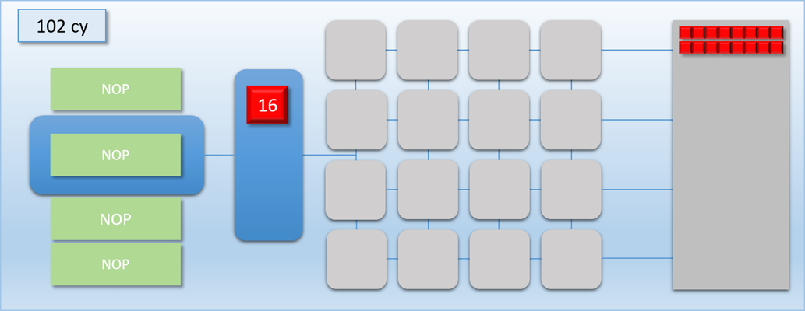

#### step5：

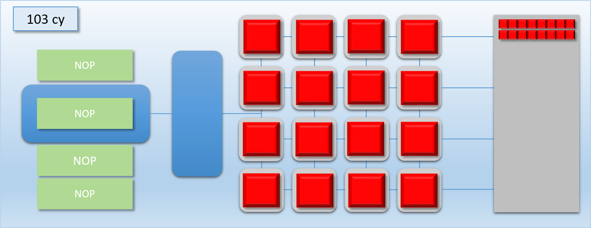

#### step6：


现在假设另外一种情况：
1. 装配24个线程运行程序”A“来写入24个独立的内存元素
2. 装配24个线程运行程序”B“，写入其它24个独立内存元素，但是程序”B“需要读取”A“要写入的内容

现在将两个批次命令放入Command Buffer，程序”A“为红色，程序”B“为绿色。

#### step1：

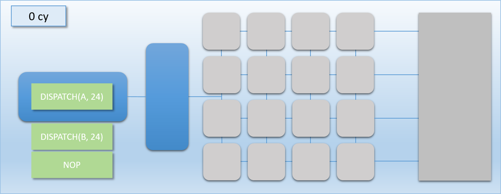

#### step2：

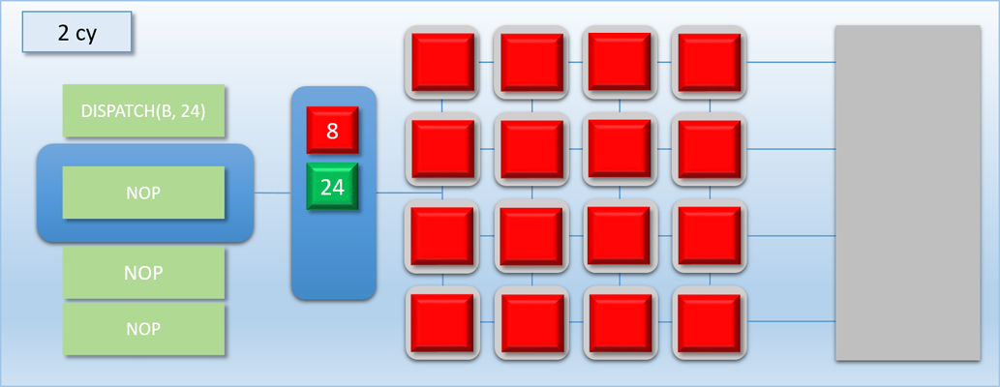

#### step3：


#### step4：

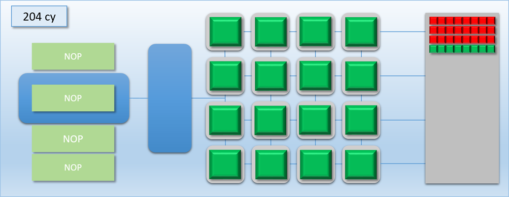

#### step5：

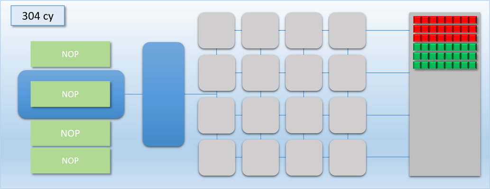

步骤三”A“和”B“同时执行，但是”B“要读取”A“写入的内存内容，这种并行运行，导致不可预测的结果。为了让”A“先执行结果，”B“在执行，需要一个同步点，这时引入新的命令**刷新（FLUSH）**，它的工作原理是：到运行到”FLUSH“命令，命令处理器等待所有的核心（shader core）运行玩自己的任务，再继续往下执行。添加”FLUSH“命令后，我们的模拟结果如下：

#### step1：


#### step2：


#### step3：


#### step4：

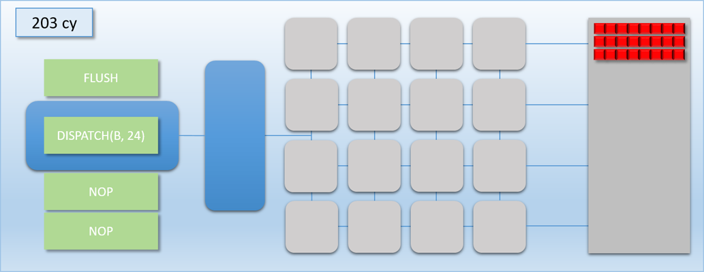

#### step5：


#### step6：


#### step7：

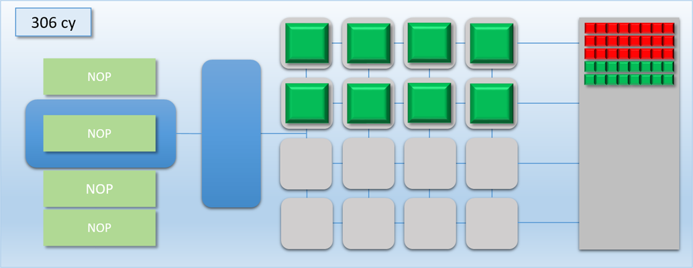

#### step8：


"FLUSH"命令阻止命令队列后续命令运行，直到线程队列里的所有线程执行结果后，继续执行后续的命令。这就是”barrier“的作用。事实上在GPU的调用流程是，先发出批次”A"，发出“barrier”等待缓存区从写状态变为读状态，然后发出批次“B”。

使用“barrier”是有性能损耗的，因为添加了“FLUSH”命令后，有空闲核心。性能的消耗基于使用率的的降低。计算性能损失就是通过核心满负荷使用的时钟周期和添加完“FLUSH”命令后的对比。因此性能损失也和线程数量，以及shader执行时间相关。

如果两个线程可以并行处理，我们可以将这种GPU的并行类比为CPU的[并行执行指令](https://en.wikipedia.org/wiki/Instruction-level_parallelism)。我们的命令流在这种情况的并行操作类似于[VLIW](https://en.wikipedia.org/wiki/Very_long_instruction_word)架构执行。

### 等待和标签
引入程序”C“可以和”A“并行执行，但是”C“需要400时钟周期，让我们来模拟这种情况：


#### step1：


#### step2：

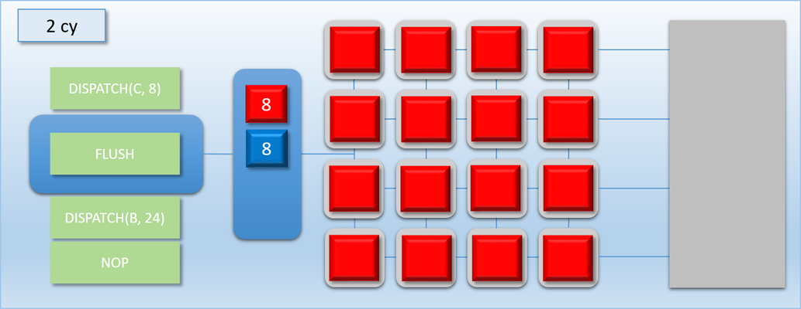

#### step3：

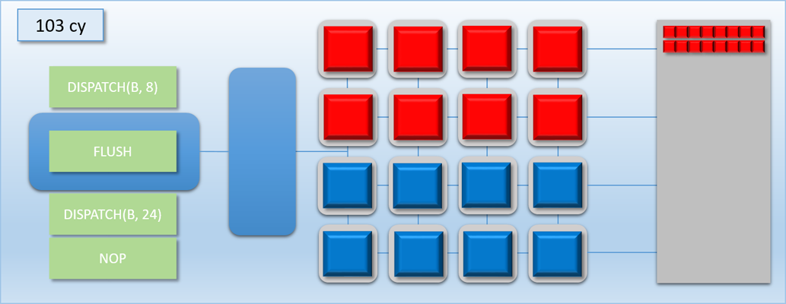

#### step4：


#### step5：

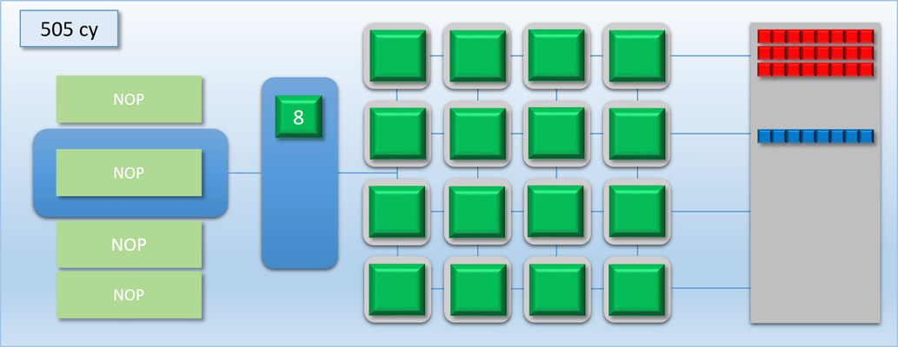

#### step6：

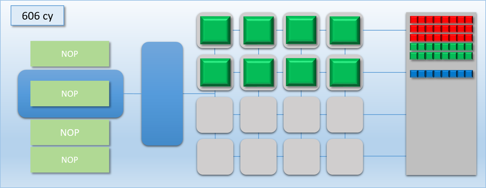

#### step7：

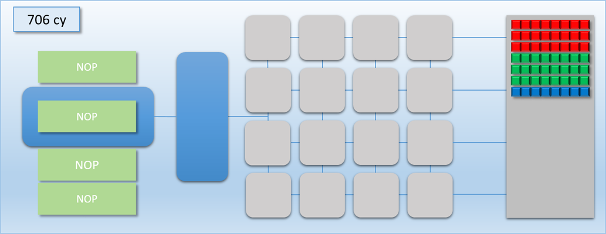


## 03 多命令处理器

## 04 gpu 抢占

## 05 回到实际应用

## 06 重叠和抢占实验