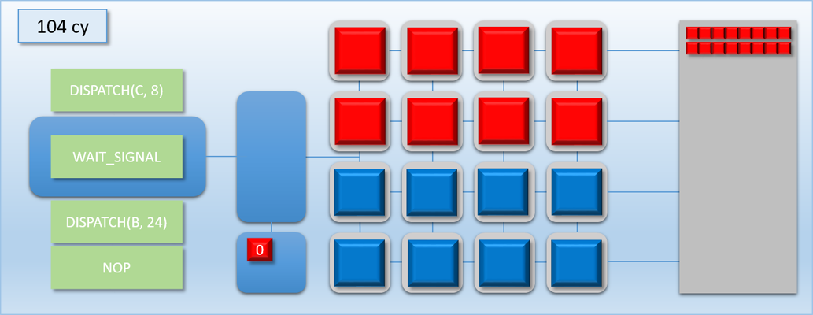
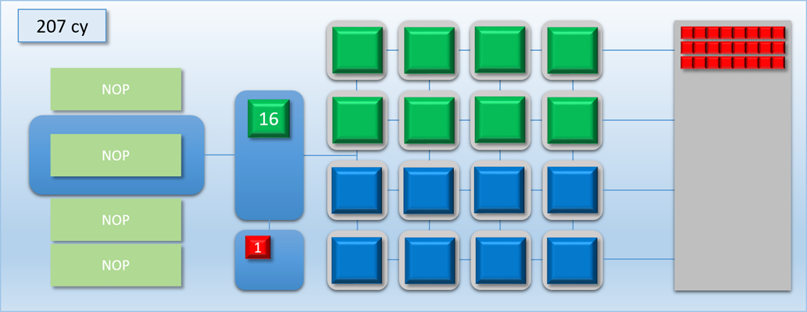

# 02 同步gpu线程

[Part1-什么是barrier](breaking_down_barriers_1.md)  
[Part2-GPU线程同步](breaking_down_barriers_2.md)  
[Part3-多核心处理器](breaking_down_barriers_3.md)  
[Part4-GPU抢占](breaking_down_barriers_4.md)  
[Part5-回到真实世界](breaking_down_barriers_5.md)  
[Part6-重叠和抢占实验](breaking_down_barriers_6.md)  

上一篇介绍了什么是”barrier“，为何要用”barrier“。当后面的绘制/批次线程依赖前面的绘制/批次线程完成时，如何确保不重叠。这篇文章挖掘GPU如何处理这种同步问题，并且讨论这种实现对高性能的影响。

## MJP-3000 编程
为了解释GPU线程同步，假想一个GPU，MJP-3000，结构如下：

### MJP 简介
* 在左边的命令处理器（Command Processor）是所有操作的核心，它的工作是从命令缓存（Command buffer）读取命令（Command），然后协调 Shader Core 执行
* 16核心的处理器相互独立，并行执行命令
* 命令处理器只执行一种类型的命令：DISPATCH，此命令做两件事：多少线程需要运行，需要运行那个shader
* 16核心可以任意访问最右边的内存（Memory）

### MJP 花费时钟周期说明
* Command Processor 花费一个时钟周期从Command Buffer读取一个Command，然后将Command打包成线程组（thread group）放入到线程队列（Thread Queue）里
* Shader Core 从线程队列里取出最先进入队列的线程（FIFO），需要另一个周期
* Shader Core 执行的周期既是执行对应Shader所需周期
 
## 调度和刷新
现在举个例子，分发32个线程，写入独立的内存元素。这些批次将执行shader ”A“，执行”A“需要100个时钟周期，16核执行完所有批次需要200个时钟周期，以下为执行流程：

### step1：

### step2：

### step3：

### step4：

### step5：

### step6：

现在假设另外一种情况：
1. 装配24个线程运行程序”A“，写入24个独立的内存元素
2. 装配24个线程运行程序”B“，写入其它24个独立内存元素，但是程序”B“需要读取”A“要写入的内容

现在将两个批次命令放入Command Buffer，程序”A“为红色，程序”B“为绿色。

### step1：

### step2：

### step3：

### step4：

### step5：

步骤三，”A“和”B“同时执行，但是”B“要读取”A“写入的内存内容，这种并行运行，导致不可预测的结果。为了让”A“先执行结果，”B“再执行，需要一个同步点，这时引入新的命令**刷新（FLUSH）**，它的工作原理是：一旦运行到”FLUSH“命令，命令处理器首先等待所有的核心（shader core）运行完自己的任务，再继续往下执行。添加”FLUSH“命令后，我们的模拟结果如下：

### step1：

### step2：

### step3：

### step4：

### step5：

### step6：

### step7：

### step8：

"FLUSH"命令阻止命令队列后续命令运行，直到线程队列里的所有线程执行结束，才继续执行后续的命令。这就是”barrier“的作用。真正意义上GPU完成此类工作的调用流程是：先执行批次”A"，再执行“barrier”等待缓存区从写状态变为读状态，最后执行批次“B”。

使用“barrier”是有性能损耗的，因为添加了“FLUSH”命令后，必须等待前置的所有线程运行结束，但是所有核心不一定满载运行。性能的消耗基于使用率的的降低。计算性能损失就是通过核心满负荷使用的时钟周期和添加完“FLUSH”命令后的对比。因此性能损失也和线程数量，以及shader执行时间相关。

如果两个线程可以并行处理，我们可以将这种GPU的并行类比为CPU的[并行执行指令](https://en.wikipedia.org/wiki/Instruction-level_parallelism)。我们的命令流在这种情况的并行操作类似于[VLIW](https://en.wikipedia.org/wiki/Very_long_instruction_word)架构执行任务。

## 等待和标签
引入程序”C“可以和”A“并行执行，但是”C“需要400时钟周期，让我们来模拟这种情况：

### step1：

### step2：

### step3：

### step4：

### step5：

### step6：

### step7：

203时钟周期使用后，核心有一半处于闲置状态，这是因为命令”FLUSH“要等待线程队列里所有的线程执行结束才可以继续往下执行。如果我们调整了”A“和”C“的顺序，先让”C“执行，但是在”A“的后面还是有核心处于闲置状态。

现在MJP-3000添加新命令，”SIGNAL_POST_SHADER“和”WAIT_SIGNAL“，命令解释如下：

* SIGNAL_POST_SHADER，当所有shader执行完成后，它通知命令处理器（Command Processor）在内存地址（称作 fence or label）写入信号数据。当线程队列里的所有线程在运行状态时，通知命令处理器执行下一个命令。
* WAIT_SIGNAL，通知命令处理器先暂停后续任务，等待内存地址被写入信号数据

新版 MJ-3000 GPU如下：

当SIGNAL_POST_SHADER 执行后，在线程队列其它地方有等待label。当状态为”0“时意味着还未收到信号，为”1“时收到信号，等待依赖将释放。

现在展示加入新命令后的模拟：

### step1:

### step2:

### step3:

### step4:

### step5:

### step6:

### step7:

### step8:

### step9:

### step10:

通过信号设置和接收的方式，让在执行”C”程序时闲置的核心全部利用起来，提升了效率。

如果对MJ-3000进行Vulkan编程，这种信号/等待行为大概就是你希望看到的，当使用分离障碍（split barrier），Vulkan里 `vkCmdSetEvent + vkCmdWaitEvents ` 组合使用。分离障碍让你高效的指定两个不同的生命点：当前状态（read，write， etc），和你需要资源所在的新状态。通过这种方式标明“barrier”的开始和结束的工作，更好的帮助驱动决定是否并行执行任务。例如，DXD12的工作方式如下：

* 命令 Dispatch A 写入Buffer A
* 开始将Buffer A 从“写->读”转换
* 命令 Dispatch C 写入Buffer C
* 结束Buffer A 从“写->读”转换
* 命令 Dispatch B 写入Buffer B

<a href="breaking_down_barriers_2.md">Pre</a>

<a href="breaking_down_barriers_3.md">Next</a>
