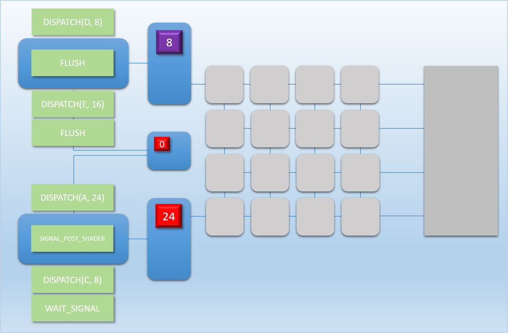
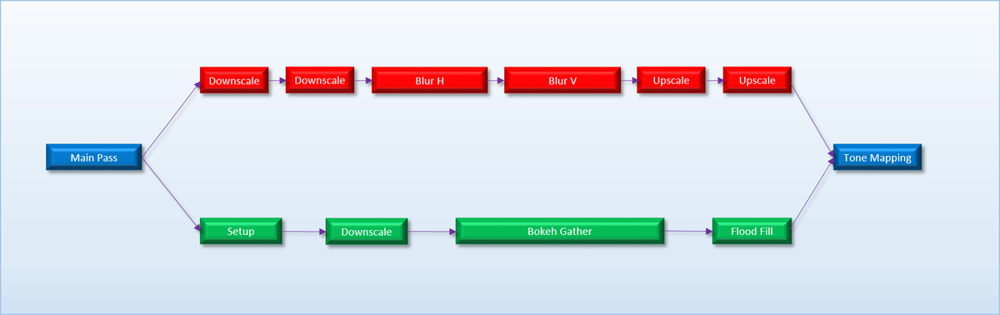

# 03 多命令处理器

[Part1-什么是barrier](breaking_down_barriers_1.md)  
[Part2-GPU线程同步](breaking_down_barriers_2.md)  
[Part3-多核心处理器](breaking_down_barriers_3.md)  
[Part4-GPU抢占](breaking_down_barriers_4.md)  
[Part5-回到真实世界](breaking_down_barriers_5.md)  
[Part6-重叠和抢占实验](breaking_down_barriers_6.md)  

这篇文章主要讨论多处理器的使用提升GPU的整体性能减少核心闲置时间。

## flushing 性能的不归路
回顾第二部分的内容，我们通过这些任务之间粗粒度的依赖关系来确保它们执行结果正确。然而我们使用的工具（GPU全局范围内的“barrier”促使所有等候的线程执行，或者称为“flush”）是一个非常生硬的语句。糟糕到我们不能在子批次级别表示依赖关系，并且非依赖的批次之间也不能并行运行。从第二章内容得到“barrier”的消耗和和GPU的使用率下降相关。

在第二部分引入了新的命令（SIGNAL_POST_SHADER 和 WAIT_SIGNAL），通过调整批次之间的运行顺序，并且使用新的命令，提升了GPU的性能。但是这种调整在实际应用中几乎不可能，一方面是对于每个任务的运行时间不好计算，另外在复杂的任务运行依赖图关系中，统筹任务的顺序非常困难。这些问题的根源就是因为只有一个命令处理器。

## 两个命令处理器优于一个
从MJ-3000 升级到MJ-4000，新添加了一个命令处理器，如图所示：

新添加的两个命令处理器通过以下方式共享GPU核心：

* 如果只有一个队列有排队的线程，队列将自己的任务铺满所有未使用的核心
* 如果两个队列都有排队线程，将剩余核心分成两部分使用（如果是奇数数量核心，上面的队列多分一个核心）
* 线程一旦在核心里执行，直到执行完成，不会被其它线程打断

两个队列提高使用率的原因是如果按照顺序执行任务线程，当出现执行的任务需要大量时间，但同时没有使用全部核心，对于不相关的任务，是可以利用闲置的核心。

现实中的GPU处理任务时，比如顶点比像素的数量少，其中还有GPU内存的压缩，解压操作，许多任务是独立的，多处理器很好的利用闲置的核心。

CPU有同样的技术，从不同的线程并行处理独立的指令，这种技术称作并行多线程（[Simultaneous Multithreading](https://en.wikipedia.org/wiki/Simultaneous_multithreading)）。
## 队列之间的同步
对于两个完全独立的队列，只需各自执行即可。如果两个队列之间有依赖关系，可以通过 `FLUSHING, SIGNAL_POST_SHADER 和 WAIT_SIGNAL` 命令组合来实现同步。假设我们有两个后处理操作：“bloom” 和 “depth of field（DOF）”，当这两个任务完成后，合并他们的结果，然后进行 HDR->SDR的转换作为最终效果。建立它们之间的依赖图，结果如下：

从它们的依赖图可以看出，处理开始和结束时需要同步，添加两个队列任务的“barrier”，结果如下图：

只需在“bloom”队列完成时添加`WAIT_SIGNAL` 命令，等待“DOF”完成写入label后，主处理器继续处理后续任务。

<a href="breaking_down_barriers_3.md">Pre</a>

<a href="breaking_down_barriers_4.md">Next</a>
