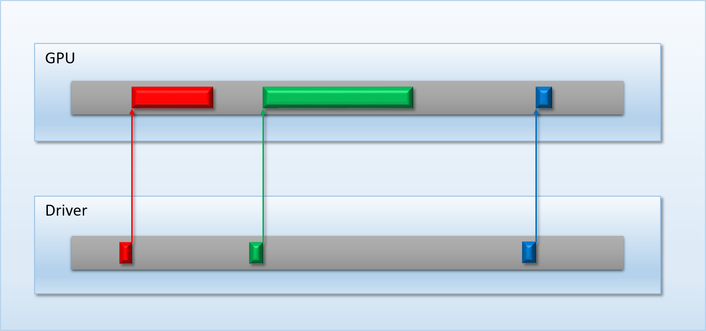
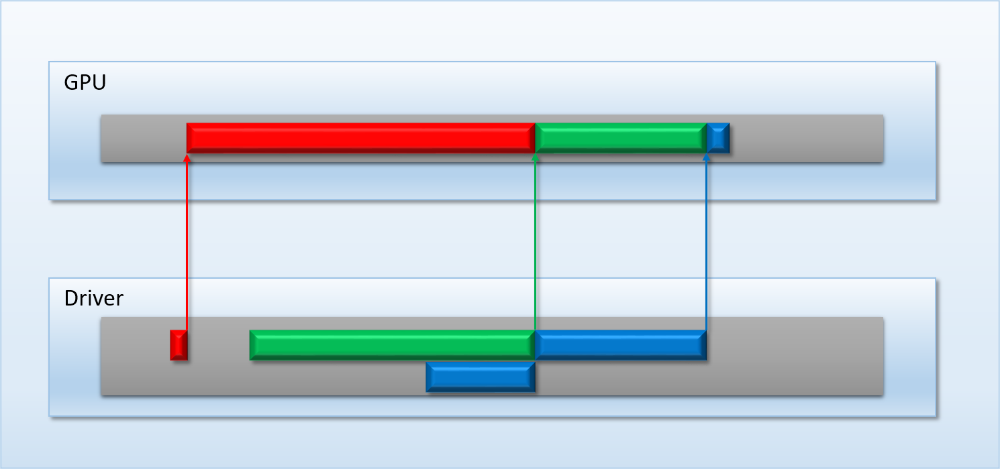
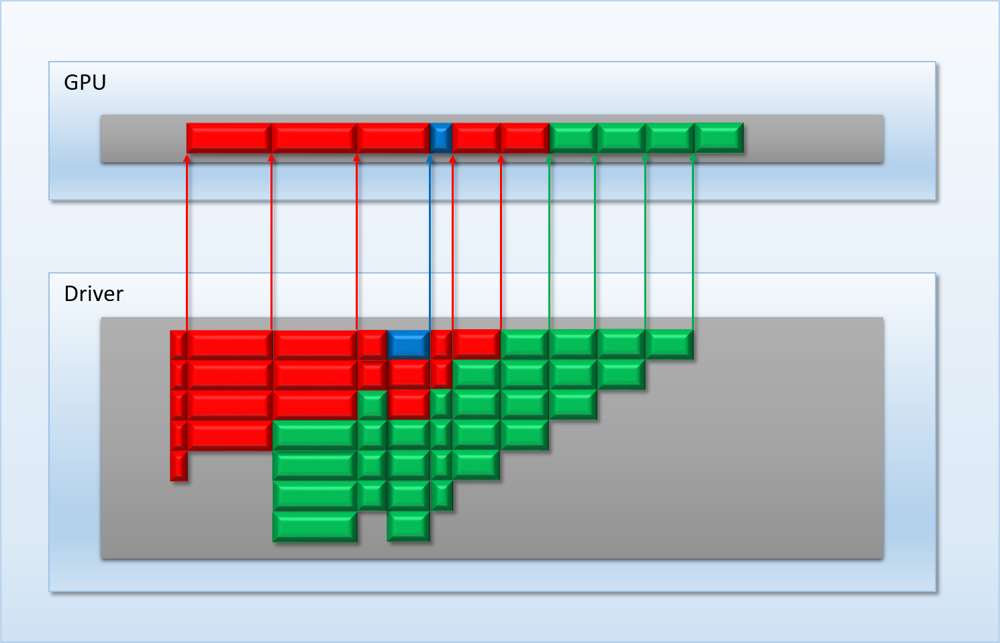
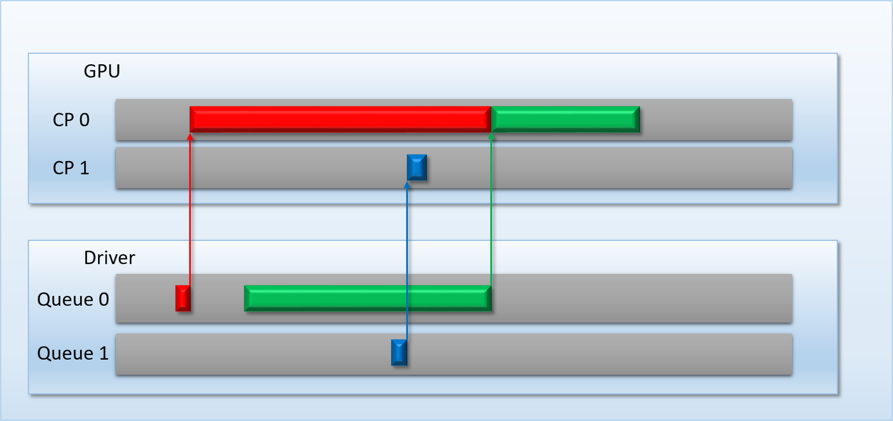

# 04 gpu 抢占

[Part1-什么是barrier](breaking_down_barriers_1.md)  
[Part2-GPU线程同步](breaking_down_barriers_2.md)  
[Part3-多核心处理器](breaking_down_barriers_3.md)  
[Part4-GPU抢占](breaking_down_barriers_4.md)  
[Part5-回到真实世界](breaking_down_barriers_5.md)  
[Part6-重叠和抢占实验](breaking_down_barriers_6.md)  

前面的文章介绍的都是单应用如何在假想的GPU上运行。实际情况是多个应用共享内存，CPU，GPU这些资源。操作系统使用GPU将各个渲染元素结合起来，Windows vista引入了 [桌面管理](https://docs.microsoft.com/en-us/windows/desktop/dwm/dwm-overview) (Desktop Windows Manager-DWM)。本文讨论在GPU上的多任务实现，以及多处理器相关操作。

## 和GPU的斗争
在2018年不要臆想在某一时刻，单个应用独占GPU。浏览器绘制UI，视频，声音的解码，VR的绘制都用到GPU。为多个应用提供服务，我们的MJ-3000使用它的独立命令处理器依然可以胜任，只要没有单个应用在某个时间点提供大量任务。期待系统或驱动有自己的逻辑可以做如下工作：驱动在软件级别维护一个或多个队列，当GPU有空闲时，将队列里的任务提交到GPU。比如3个APP可以入如下图共享GPU：

上图中，底部是驱动的队列，上部是GPU的队列，在上面的应用情境中，红绿蓝三个任务在不同的时间点，都直接被GPU执行。反过来看，当事情不按如上情景发展时：

这次红色任务占用了大量的GPU时间，导致绿色的和蓝色的任务不能及时运行，假设蓝色的任务是紧急任务，这会导致用户的预期不一致。

要适用于高优先级应用使用GPU，我们需要[抢占模式](https://en.wikipedia.org/wiki/Preemption_(computing))（preemption）。MJ-3000架构决定一次只能执行一个命令，并且一旦执行，就会执行到结束为止，不可打断。因此最简单的方式是驱动或者系统将任务分割为更小的命令缓存单元（command buffer）。这样就有驱动颗粒级别的任务在任务队列里，然后让优先级更高的任务提前执行：

通过分割为小的执行单元，蓝色的任务提交后，排在了任务队列的最上层，当执行完上一个任务，蓝色任务抢占了到了GPU。

有了命令缓存级别的抢占，意味着抢占式的颗粒度依赖于命令缓存的颗粒度。GPU无法估量每个命令缓存需要多长的运行时间，也许最好的方式是GPU使用启发式预先将命令缓存分割为GPU可以一口吃下的命令缓存单元。

通过这种途径，导致的另外一个问题是可能导致吞吐量降低，即便是没有抢占发生。因为分割为多个小块命令缓存，将导致增加多个同步点，同时可能导致线程不能并发运行（这里是说不分割前一个任务派发1000个线程，分割后两个任务各派发500个任务，如果有1000个核，那就分两次执行了-笔者记）。另一个问题是需要考虑如何处理命令缓存设置的GPU状态，MJ系列GPU只有计算shader没有状态，但真实的GPU支持全部D3D/GL/VULKAN光栅化管线有各种各样被命令缓存设置的状态。这些状态设置包括视窗转换，绑定渲染对象，深度缓存设置，以及每个阶段对应的shader。如果驱动不能保存和读取这些状态，在切换命令缓存时，这将会增加GPU和CPU的复杂度去切割每个小的命令缓存（command buffer）。

## 让硬件解救我们
如果想高优先级的任务减少延时执行，需要改善GPU的处理命令的逻辑，而不是使用驱动软件管理队列。一种解决方案是在命令流（command stream）执行过程中，可以让高优先级的先执行，但是这还是依赖“wait/flush“的执行，并且如果先前的命令如果占用很长的执行时间，还是不能有效的提前高优先级任务执行。同时如果让高优先级的任务执行了，保存和读取状态的事情还是需要解决。

还有其它解决方案就是像MJ-4000增加多个命令处理器。有了多个命令处理器，非常占资源的APP占用一个命令处理器，优先级高的任务占用另一个处理器，在合适的时机，高优先级的任务优先占用核心执行任务，这样也不影响其它任务队列。高效的做这件事，只要定好以下规则即可：

* 如果只有一个队列有等待线程，并且有空闲核心，队列将使用所有空闲核心，直到没有等待线程
* 如果有两个队列有等待线程，并且有空闲核心，根据提交到队列里的任务优先级，核心将划分为两部分。如果有一队列的优先级高，则优先占用核心，剩余的核心留给另一个队列。如果两个队列优先级一样，则平分核心（如果核心数为奇数，上面的队列多占用一个核心）。
* 线程总是执行结束，意味着排队线程不能打断正在执行的线程。

由于已经在执行的线程不能打断，所以称作线程级别的抢占。虽然是线程级别的抢占，但当前优先执行的线程即将运行的延迟时间依赖上一个线程执行时长，但在实际的GPU中，有很多核心。大多数情况下，执行优先级高的任务，都会被及时执行，如下图时间线：

通过上图可知，如果有高优先级的任务，在等待很短的时间内（比如说一帧），就可以得到执行。

支持线程级别的抢占，高优先级的任务需要等待的时间为：当所有核心被占用，最先空闲出的核心所需要的时间。如果不想等待，那需要打断当前执行的线程。这就需要指令级别的抢占（instruction level preemption)，因此粒度级别为shader核心指令级别。这种类型的抢占在CPU上非常普遍，因为可以在CPU指令流的中间切换上下文（contexts），GPU上下文切换很不实际，因为大量的线程需要总共成百上千的寄存器。

<a href="breaking_down_barriers_4.md">Pre</a>

<a href="breaking_down_barriers_5.md">Next</a>
