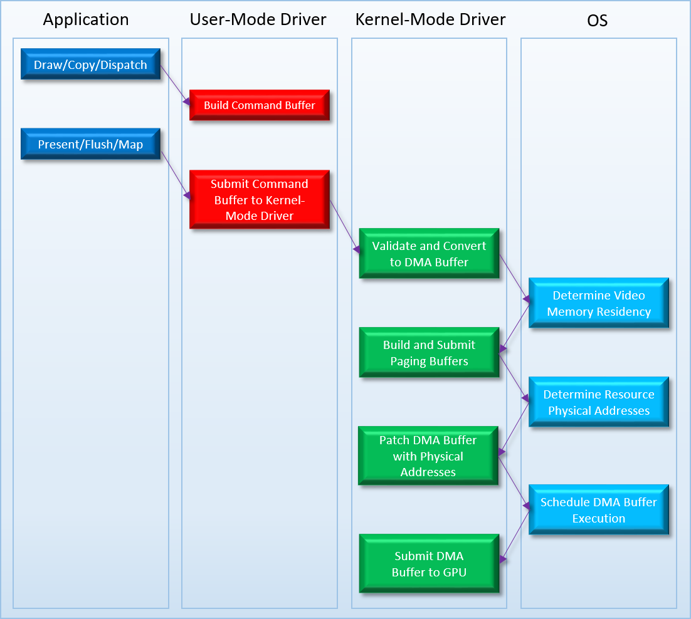
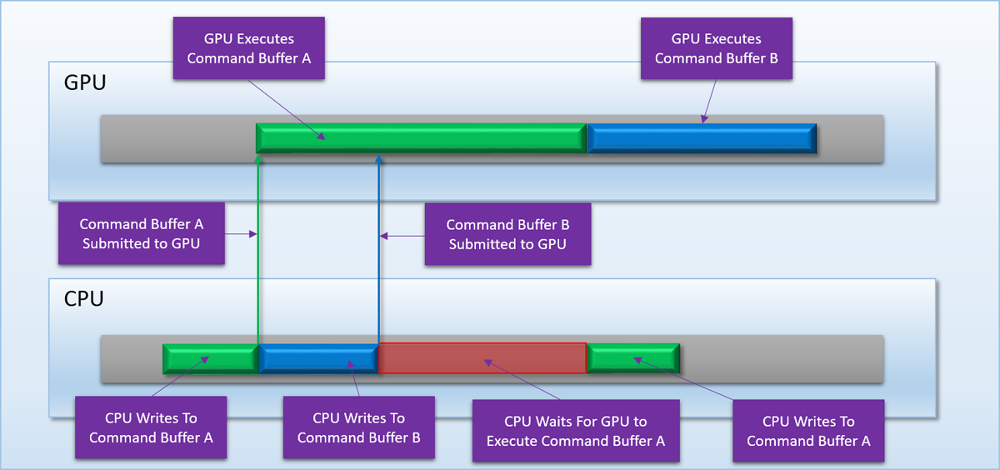
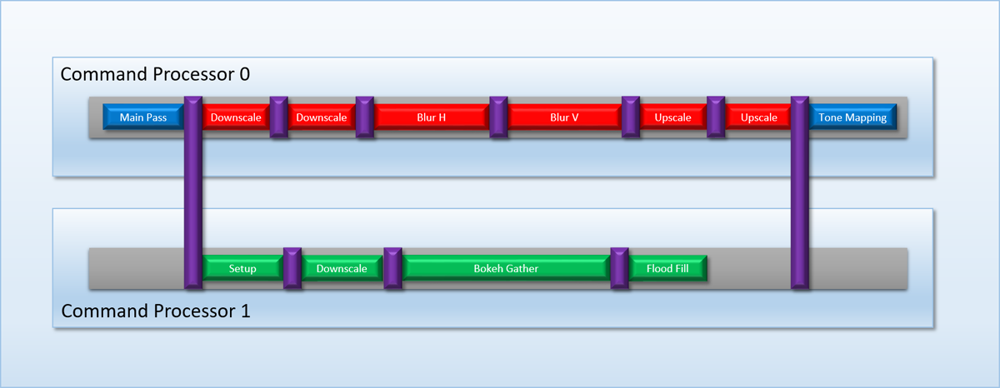
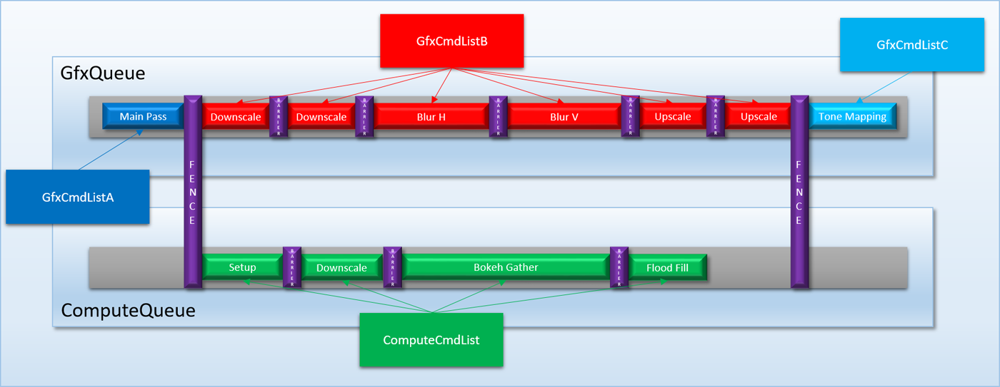
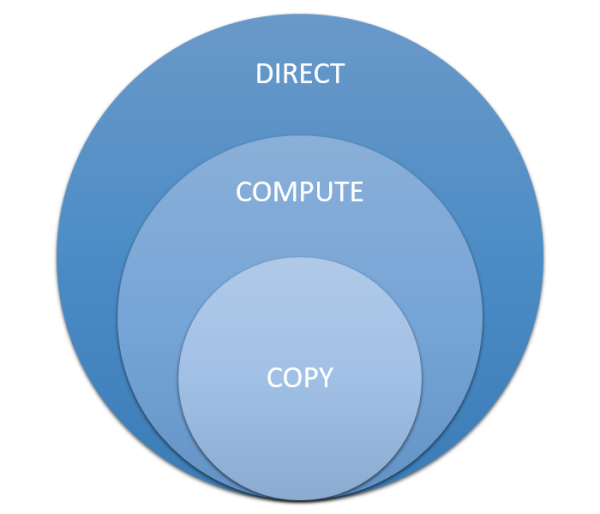
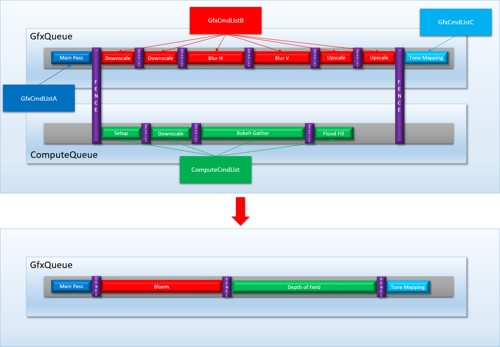
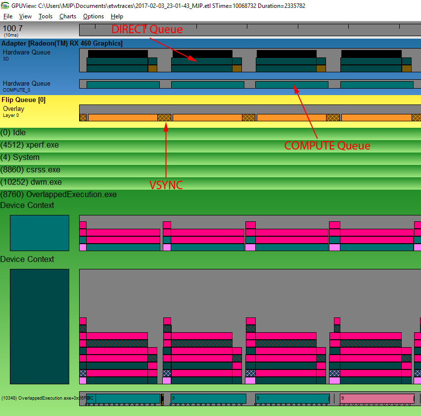

# 05 回到实际应用

[Part1-什么是barrier](breaking_down_barriers_1.md)  
[Part2-GPU线程同步](breaking_down_barriers_2.md)  
[Part3-多核心处理器](breaking_down_barriers_3.md)  
[Part4-GPU抢占](breaking_down_barriers_4.md)  
[Part5-回到真实世界](breaking_down_barriers_5.md)  
[Part6-重叠和抢占实验](breaking_down_barriers_6.md)  

本篇讨论真实世界的GPU，如何处理在系统（OS）以及驱动语义下竞争。主要集中讨论微软（Microsoft Windows）相关的视窗显示驱动模型（Windows Display Driver Mode - WDDM）和原生3d图形接口（D3D11和D3D12)。本文的第一部分主要讨论Windows10以前的技术，这部分内容提供了很多有价值的背景知识用来理解为什么D3D12要如此设计，这也是本系列的核心主题。

## 过去：XDDM 和 WDDM 1.x
在D3D9运行在Windows Xp的年代，应用几乎不使用GPU，通常都是游戏在全屏模式下使用。在技术上可以让两个程序轮流使用GPU绘画自己的界面，但这两个程序合作的友好程度，依赖于特定的显卡，以及对应的驱动程序。导致这种问题的原因是Windows 2000/XP 显示驱动模型（又称作 XP Display Driver Model-[XDDM](https://docs.microsoft.com/en-us/windows-hardware/drivers/display/windows-2000-display-driver-model-design-guide)， 或者XPDM）几乎全部让显示驱动处理类似于：调用命令缓存在GPU上的执行，管理多核GPU资源内容，这些复杂问题。在管理内存/资源这些事情上非常粗糙，因为系统和驱动通过古老的[DirectDraw infrastructure](https://docs.microsoft.com/en-us/windows-hardware/drivers/display/directdraw-architecture)运行。最重要的是依然使用过时的，拥有自己[驱动堆栈](https://docs.microsoft.com/en-us/windows-hardware/drivers/display/graphics-system-overview)的GDI管线作为D3D和DriectDraw交互媒介。

当你刚刚认为3d GPU只是被少数人用来玩游戏，2d 图形加速器才普及这样一种情景。然而随着Windows vista 发布临近，事情迅速的发生了变化。在低端机器上都附加上了3d功能图形处理器（感谢[Intel的GMA系列](https://en.wikipedia.org/wiki/Intel_GMA)集成显卡），随着GPU的可编程性增强，导致很多有识之士挖掘除了3d游戏以外的的功能。微软的系统开发者使用GPU 3D渲染功能来展示Windows 系统UI。换句话说，随着GPU的提升，是时候让OS/Driver技术栈一起进化，这就是[WDMM](https://en.wikipedia.org/wiki/Windows_Display_Driver_Model)推出的原因。

WDDM是”[Windows Diplay Dirver Model](https://docs.microsoft.com/en-us/windows-hardware/drivers/display/windows-vista-display-driver-model-design-guide)“的缩写，是新的驱动技术栈，从Windows Vista开始来替代 XDDM/XPDM。WDDM相比旧的版本，是一种新的开始，它开始将显卡板载内存当做共享资源来被系统统筹调度。比如使用WDDM后，系统负责提交命令缓存（Command Buffer）到GPU，驱动仅仅提供[接口](https://docs.microsoft.com/en-us/windows-hardware/drivers/display/submitting-a-command-buffer)（hooks）来构建对应硬件格式的命令缓存（Command Buffer），然后被系统协调调用执行。这就允许系统内部协调器决定何时应给执行特定的程序包，或者说决定一个程序的绘制命令比另一个程序的更重要。与此相类似，全局的显存管理器拥有控制板载显卡内存的权限，驱动提供了[接口](https://docs.microsoft.com/en-us/windows-hardware/drivers/display/paging-video-memory-resources)允许系统将内存数据转移到显卡内存，反之亦然。这帮助统一所有厂商的GPU内存管理。通过有效虚拟化所有资源，消除了对D3D9中旧的[MANAGED资源池](https://docs.microsoft.com/en-us/windows/desktop/direct3d9/managing-resources)等创可贴的需求。WDDM驱动技术栈的[通用流程](https://docs.microsoft.com/en-us/windows-hardware/drivers/display/windows-vista-and-later-display-driver-model-operation-flow)如下图所示：



* [DMA buffer](https://docs.microsoft.com/en-us/windows-hardware/drivers/display/introduction-to-command-and-dma-buffers)，驱动有用户模式/内核模式之分，在用户模式称作命令缓存（Command buffer，在内核模式下内核将命令缓存称作DMA）
* WDDM 1.0 GPU的内存管理很简陋，只能使用物理地址访问内存。当处理缓存（buffer），贴图等资源，使用厂商提供的驱动直接访问物理地址是个坏的注意。但是在WDDM下，系统显存管理器能够按照需求将资源移出移进设备内存。
* WDDM请求驱动根据DMA buffer里Command提交分配表和补丁表。分配表告知系统DMA buffer里的command所引用的所有资源，通过这些信息，内存管理器决定哪些资源保留在设备内存里。补丁列表告知系统DMA buffer真正引用的资源所在地址，通过这些信息，buffer在GPU执行之前，系统[使用物理地址修复DMA缓存](https://docs.microsoft.com/en-us/windows-hardware/drivers/ddi/content/d3dkmddi/nc-d3dkmddi-dxgkddi_patch)(patch the DMA buffer with physic address)。

很明显就算APP使用很少的draw calls，在这背后需要调用很多东西。幸运的是D3D应用开发者只需要关心最左边的，其它的部分都是隐藏的。事实上D3D10/D3D11的抛出的接口都没有说明：处理器是并行的执行充满命令的buffer流。大多数情况下，可以假装绘画命令和批次通过GPU的缓存命令同步执行，因此可以得到正确的结果。唯一能发现这个问题的时机是：当CPU等待GPU渲染结果时，查看批次绘制的时间线。这样看来，使用D3D的开发者从D3D9转到D3D10/D3D11很容易，这个[文档](https://docs.microsoft.com/en-us/windows/desktop/direct3darticles/graphics-apis-in-windows-vista)里有说明。系统和驱动开发者就没这么幸运了，初始从XDDM专向WDDM1.0非常的曲折艰难。经过这些年的淬炼证明它是非常值得的，当前允许[windows使用GPU合并所有的桌面窗口](https://docs.microsoft.com/en-us/windows/desktop/dwm/dwm-overview)，或者[Chrome使用GPU加速](https://www.chromium.org/developers/design-documents/gpu-accelerated-compositing-in-chrome)网页渲染，同时用最高配置玩战地一。

通过Windows版本和系统补丁，WDDM有许多小的更新，值得说的是Windows 8有个主要提升，从WDDM1.2，驱动可以[提供是否支持对命令缓存的竞争](https://docs.microsoft.com/en-us/windows-hardware/drivers/display/gpu-preemption)，并且说明具体粒度的竞争等级。驱动通过提供两个枚举说明支持的竞争类型，一个是[图形类型](https://docs.microsoft.com/en-us/windows-hardware/drivers/ddi/content/d3dkmdt/ne-d3dkmdt-_d3dkmdt_graphics_preemption_granularity)另一个是[计算类型](https://docs.microsoft.com/en-us/windows-hardware/drivers/ddi/content/d3dkmdt/ne-d3dkmdt-_d3dkmdt_compute_preemption_granularity)，通过查看计算类型的枚举发现和我们之前讨论的竞争粒度非常相似：

```C++
typedef enum _D3DKMDT_COMPUTE_PREEMPTION_GRANULARITY {
D3DKMDT_COMPUTE_PREEMPTION_NONE ,
D3DKMDT_COMPUTE_PREEMPTION_DMA_BUFFER_BOUNDARY ,
D3DKMDT_COMPUTE_PREEMPTION_DISPATCH_BOUNDARY ,
D3DKMDT_COMPUTE_PREEMPTION_THREAD_GROUP_BOUNDARY ,
D3DKMDT_COMPUTE_PREEMPTION_THREAD_BOUNDARY ,
D3DKMDT_COMPUTE_PREEMPTION_SHADER_BOUNDARY
} D3DKMDT_COMPUTE_PREEMPTION_GRANULARITY;
```

## D3D11和WDDM 1.X 的问题
正如之前讨论的，合适粒度的竞争可以让多线程更好的发挥，尤其当一个应用想完全使用GPU。

从D3D应用开发者角度来看，从Windows xp时代到Windows 7时代，使用D3D体验变得更好用，更简单。但是在性能和多线程方面还是有很多问题。

回到D3D11发布时，围绕着通过[延迟上下文](https://docs.microsoft.com/en-us/windows/desktop/direct3d11/overviews-direct3d-11-render-multi-thread-render)(deferred contexts)进行多线程渲染有大量报道。技术上可行，实际上并不是按照大家希望的方式实现。最大的问题在第一部分讨论过：当多线程生成渲染命令时，使用高效的方法让命令隐式的独立是非常困难的。假设运行整个系列命令渲染一帧，必须要检测深度缓存从写状态变为一个可读贴图发生的时刻，这又迫使你在生成硬件命令之前，按照顺序序列化命令组。如果你的目标是通过多核心分散创建缓存命令的损耗，这基本没啥用，但这是使用延迟命令列表唯一原因。这种不实用性导致许多Windows游戏继续使用单线程渲染。

另一个问题是D3D11不能利用现代GPU的多命令处理器/硬件队列。正如第三部分提到的，提交命令到多个前端可能提升更高的shader核心使用率，从而导致更高的吞吐量。有效使用这些额外的命令处理器需要识别和提交多个互不依赖的命令链。让驱动自动做这件事非常的困难，尤其当数据的独立性是隐性而非显性。如果你考虑一下，这和通多线程利用CPU多核非常相似：编译器处理识别单个线程指令之间的依赖，但它不能提取足够多的独立指令序列让操作系统再起一个线程执行。由于D3D/WDDM1.x隐式的构造和提交命令缓存，使得问题变得更加困难，这意味着没有地方提示应用显式的使用那个前端提交系列命令。最重要的是GPU限制具体的命令执行在对应的命令处理器上（比如，一些命令只能执行在运算处理器上），但是D3D11没有通过API表现这些限制。

最后讨论的问题技术性不强，主要是API提供的抽象性以及和延迟列表相关的事情。如前面所说，D3D11采用的模型是命令缓存录制和提交到硬件是隐式的，命令执行顺序是依据应用发出的命令序列顺序，这完全隐藏在驱动背后，同时有效的隐藏了GPU异步/并行的特性，并且让你认为draw/dispatch/copy命令同步执行，所以可以得到正确的结果。或者至少使用的立即上下文是同步执行的。延迟上下文打破了这种抽象，虽然它的语义暗示命令不会立即执行，但是延迟上下文通过立即模式来实现，调用[ExecuteCommandList](https://docs.microsoft.com/en-us/windows/desktop/api/d3d11/nf-d3d11-id3d11devicecontext-executecommandlist)时命令被执行，从而达到延迟的效果。这没啥问题，但是立即模式没有”立即“执行非常的奇怪，其实也是隐式的”延迟“执行。这样看的话，延迟上下文是个双延迟上下文。除了这个怪事之外，由于面向用户的执行模型，延迟命令列表有一些奇怪的限制。特别是[MAP](https://docs.microsoft.com/en-us/windows/desktop/api/d3d11/nf-d3d11-id3d11devicecontext-map)操作被限制只能写操作，不允许任何读相关的操作，这是由于在调用ExecuteCommandList之前，延迟命令列表上的命令不会执行（从应用的视角看），反过来意味着确实不能读取先前命令的执行结果。这和当前D3D12的运行方式很相似，但有些奇怪的是这些语义仅应用在D3D11多线程编程。最后我怀疑，当使用D3D11_MAP_WRITE_DISCARD时幕后发生的，自动内存管理/版本操作需要在多线程，延迟上下文的情境中支持，将事情推向到了突破点。在某些时候，让应用使用自己的需求信息，管理内存和提交命令更有意义。

## 当前：WINDOWS 10，D3D12，以及WDDM 2.0
借助D3D12和WDDM2.0，API和驱动栈暴露出了任务如何提交到GPU。除了抽象出命令被录制到缓存并且被并行处理器异步执行这个事实，D3D12几乎将所有细节暴露给应用程序。API提供接口录制命令（[ID3D12GraphicsCommandList](https://docs.microsoft.com/en-us/windows/desktop/api/d3d12/nn-d3d12-id3d12graphicscommandlist)），另一个命令给录制的命令分配内存（[ID3D12CommandAllocator](https://docs.microsoft.com/en-us/windows/desktop/api/d3d12/nn-d3d12-id3d12commandallocator)），还有一个函数允许将录制好的命令列表放到执行队列里（[ExecuteCommandList](https://docs.microsoft.com/en-us/windows/desktop/api/d3d12/nf-d3d12-id3d12commandqueue-executecommandlists)）。当然这种新的特性伴随着新的责任。自从APP在驱动的位置上，APP需要意识到命令缓存正在运行中，防止写入此状态的缓存。这导致典型的双缓存”提交循环（submission loop）“，应用需要在旧的命令缓存执行结束后，可以使用对应的执行结果。



自从对所有内存和资源的生命周期管理负责，在使用D3D12的地方，基本都是处理相似的模式。当更新常量缓存时，不在有默认`MAP_DISCARD`来保护内存，对应的必须建立自己的流程机制来获取安全的内存。如果你想读回GPU执行结果，必须确保提交了对应的命令缓存并且在读回CPU之前要等待命令完成。正如在第一个讨论的”barriers“，从驱动管理移交到应用程序管理对于开发者来说是非常大的负担。这种转变出自同样确定的原因：以实现更高的效率和多线程。划分命令生成的自然方法是让每个线程或任务生成自己的命令缓存，当所有的命令录制完毕后，按照顺序（”chain“）提交到队列。当这种命令生成方式和显示”barriers“以及通过PSO（pipeline state object）的一个指定管线状态的独立接口相结合，将获得一个真正的通过CPU多核心并行生成命令缓存的API。

提供更明确的提交控制还使APP利用GPU有多个前端的优势出排列或处理命令。在第三部分讨论了让GPU增加命令处理器来提升核心的使用率，当一个APP提交多个独立依赖链到不同的处理器时。如过陷入旧的D3D11模型，其中任务依赖和提交是隐性的，那么驱动提取非依赖的调度链在第二个命令处理器执行几乎不可能。幸运的是使用D3D12，可以明确地说”这个命令列表可以单独执行，并且依赖其它命令列表“，通过命令队列和围栏（fences）来实现。命令队列（command queue），如名字所示，可以在其中提交命令缓存（录制完命令）在GPU上运行。当创建命令队列时，可以指定三种不同类型的命令列表运行在队列上：

1. COPY-可以执行`CopyResource`命令
2. Compute-可以执行`CopyResource` 和`Dispatch`命令
3. DIRECT-可以执行`CopyResouce`、`Dispatch`和`Draw`命令

这些命令列表类型可能对应GPU上不同”引擎"，这就是D3D/WDDM喜欢调用命令处理器的原因。每个引擎可以运行自己不同系列的命令集，因此有三种类型的命令列表。通常独立GPU至少有个可以执行所有命令的处理器，以及至少一个DMA单元，其可以发出针对通过PCI-e总线传输而优化的命令。许多最新的GPU有独立的运算命令处理器，后续在讨论。

现在回到第三部分的后处理案例：



让两个依赖链在两个命令处理器上执行，使用D3D12通过如下的步骤：

* 创建一个`DIRECT`命令队列（Command Queue），称作**GfxQueue**
* 创建三个`DIRECT`命令列表（Command Lists），分别称作 **GfxCmdListA**、**GfxCmdListB**以及**GfxCmdListC**
* 创建一个`COMPUTE`命令队列和命令列表，称作**ComputeQueue**和**ComputeCmdList**
* 创建两个`fences`，称作**FenceA**和**FenceB**
* 每一帧：
  * 录制所有Main Pass的渲染命令到**GfxCmdListA**
  * 录制所有bloom渲染命令到**GfxCmdListB**
  * 录制所有的tone mapping和后续渲染命令到**GfxCmdListC**
  * 录制所有的DOF批次到**ComputeList**
  * 提交**GfxCmdListA**到**GfxQueue**
  * 当**GfxCmdListA**完成时，从**GfxQueue**通知**FenceA**
  * 提交**GfxCmdListB**到**GfxQueue**
  * 告知**ComputeQueue**等待**FenceA**
  * 提交**ComputeCmdList**到**ComputeQueue**
  * 当**ComputeCmdList**完成时，从**ComputeQueue**通知**FenceB**
  * 告知**GfxQueue**等待**FenceB**
  * 提交**GfxCmdListC**到**GfxQueue**



由于这些D3D12命令非常明确的指出命令列表之间的依赖关系，以及命令列表应当提交的队列类型，因此操作系统和驱动有足够的信息来在不同的命令处理器上真正的调度命令列表。这是对D3D11的重大改进，其隐式的提交模型并未真正的允许这种情况发生。

根据队列和提交任务的API的工作方式，可能诱导大家认为提交命令列表到`ID3D12CommandQueue`会直接提交相关命令缓存到特定的GPU硬件前端队列。但在D3D12和WDMM2.0模式下这不是真的。当我们复盘WDDM1.x细节时，OS有自己的命令调度机制来决定一个命令缓存何时在GPU上运行，并且这些命令缓存是来自己于多个应用提交。D3D12和WDDM2.0情况依然如此。因此没有将命令缓存提交到硬件队列，而是提交了OS调度中心。除了让操作系统处理多个应用之间的共享资源，它还允许操作系统虚拟化队列，以便不支持多个前端的硬件拥有多个“虚拟队列“（在D3D12和WDDM术语中称作GPU只有一个引擎）。如果查看上面列出的对队列类型的描述，你可能注意到每个队列类型的支持命令列表实际上是下一个队列类型支持的子集。换句话说`DIRECT`可以做`COMPUTE`和`COPY`队列类型的事情，`COMPUTE`可以做`COPY`队列类型能做的所有事情。

<p align="center">

</p>

将queue/engine功能制定被彼此的子集，如有需要，系统可以将提交到`COPY`队列的任务重定向到`DIRECT`引擎。这使应用程序不必根据用户的硬件和驱动支持的功能更改提交命令缓存的方式。然而为了解决这个问题，系统必须可以将并行命令缓存”压平（flatten）“到串行的命令缓存流。举个例子，让我们回到之前使用过的DOF/bloom研究案例。如果要在只有一个`DIRECT`引擎的GPU上提交该系列命令缓存，OS必须将提交内容铺平为下图所示：

<p align="center">

</p>

由于bloom和DOF是相互独立的命令缓存集合，所以它们以任何顺序执行都可以得到正确的结果。但是也可以通过OS创建[更高优先级](https://docs.microsoft.com/en-us/windows/desktop/api/d3d12/ne-d3d12-d3d12_command_queue_priority)的队列让其中一个提交任务先执行。我们也必须注意到OS需要知道队列之间的依赖关系才可以进行扁平化操作，这就是为啥fences是重量级系统级别结构而不是轻量级同步操作。这也是无法在命令列表里跨队列同步的原因，这对于应用来说很方便，但会破坏调度程序将提交任务铺平到多个队列的可能性。从OS全局掌控提交依赖关系的一个好处是，它可以提前检测和阻止某些死锁，这比让OS阻塞好很多。

如果好奇系统和调度器如何在幕后使用缓存命令集合，最好的方式是使用[GPUView](https://graphics.stanford.edu/~mdfisher/GPUView.html)（这是使用[Bruce Dawson's](https://randomascii.wordpress.com/) 最有价值的 [UIForETW tool](https://github.com/google/UIforETW) 最容易做的事情）。下面是捕获提交大量任务提交到AMD RX460的`DIRECT`和`COMPUTE`队列上例子：




<p style="float: left"><a href="breaking_down_barriers_5.md">Pre</a></p>
<p style="float: right"><a href="breaking_down_barriers_6.md">Next</a></p>