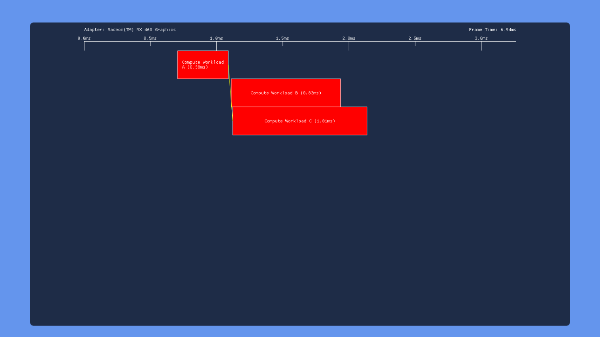

# 06 重叠和抢占实验

[Part1-什么是barrier](breaking_down_barriers_1.md)  
[Part2-GPU线程同步](breaking_down_barriers_2.md)  
[Part3-多核心处理器](breaking_down_barriers_3.md)  
[Part4-GPU抢占](breaking_down_barriers_4.md)  
[Part5-回到真实世界](breaking_down_barriers_5.md)  
[Part6-重叠和抢占实验](breaking_down_barriers_6.md)  

前面的篇幅介绍了“barriers”的工作原理，以及多硬件队列如何改善GPU线程竞争和吞吐量。这篇文章理论结合实践，通过[示例程序](https://github.com/TheRealMJP/OverlappedExecution)使用DXD12在Windows10上运行测试。

为了测试需要趁手的工具来检验不同的硬件测试DX12对显示任务同步以及多队列功能。不同硬件厂商提供工具可以捕获一段时间内的数据，但是没有显示不同任务之间在GPU上的同步竞争。PIX for Windows可以查看一段时间内任务在GPU上的竞争，但在当时还没发布，并且不能显示计算队列上的任务竞争，还有就是只能分析显示离线数据。(AMD后来有非常棒的工具[GPU profile](https://gpuopen.com/gaming-product/radeon-gpu-profiler-rgp/)，不仅显示任务在GPU上的并行运行，同时也显示对barriers的响应，但在写这篇文章时，这个工具还没发布)。

因此只能自己打造工具来测试。D3D12通过[timestamp queries](https://msdn.microsoft.com/en-us/library/windows/desktop/dn903946(v=vs.85).aspx)提供了内部机制来追踪GPU运行时间。这个用来追踪粗粒度的运行时间有用，比如GPU帧渲染时间，或者非透明组渲染时长。对于GPU线程级别的时间，不同硬件驱动返回的值各不相同，所以决定自己造轮子。

通过添加一块GPU可写内存，shader在自己的开始和结束写入内存位，然后在CPU端判断内存值变化来获取GPU端任务运行时间线。添加如下类型的内存块来做这件事：
```C++
D3D12_HEAP_DESC heapDesc = { };
heapDesc.SizeInBytes = 128 * 1024;
heapDesc.Flags = D3D12_HEAP_FLAG_ALLOW_ONLY_BUFFERS;
heapDesc.Alignment = 0;
heapDesc.Properties.CPUPageProperty = D3D12_CPU_PAGE_PROPERTY_WRITE_COMBINE;
heapDesc.Properties.CreationNodeMask = 0;
heapDesc.Properties.MemoryPoolPreference = D3D12_MEMORY_POOL_L0;
heapDesc.Properties.Type = D3D12_HEAP_TYPE_CUSTOM;
heapDesc.Properties.VisibleNodeMask = 0;
DXCall(DX12::Device->CreateHeap(&heapDesc, IID_PPV_ARGS(&workload.ReadbackHeap)));
```

设置 **CPUPageProperty** 为WRITE_COMBINE保证从CPU方面不缓存，这就使内存只能通过GPU写入而不是CPU写入。使用**MEMORY_POOL_L0**来让内存块分配在系统内存里而不是显存里，这保证CPU可以访问这块内存。同时这个参数设置GPU写入数据时不写入缓存，直接写入这块内存，这可以让CPU及时读取GPU写入数据，而不是还要等待GPU缓存刷新。最终保证整个过程是实时的，唯一的延迟就是GPU和CPU的通信之间。

其它关键部分是让第一个线程将值写入“start” buffer，最后一个线程将值写入“end” buffer。API不能保证线程的先后执行顺序，所以不能依赖SV_DispatchThreadID或者SV_Position去探测第一个和最后一个调用，所以使用全局变量通过原子操作来获取每个线程的调用索引：
```shader
uint prevValue = 0;
CounterBuffer.InterlockedAdd(0, 1, prevValue);
if(prevValue == 0)
ShaderStartBuffer[0] = CBuffer.FrameNum;
 
// Do actual shader workload
 
if(prevValue + 1 == CBuffer.NumWorkloadElements)
ShaderEndBuffer[0] = CBuffer.FrameNum;
```
在start/end buffers写入帧数因此它们将持续增加计数，从而避免每帧清理。

记录单帧工作任务耗费时间通用流程如下：

* 使用`ClearUnoderedAccessViewUint`命令将CounterBuffer置零
* 发出`draw/dispatch`命令
* 将UI绘制在back buffer
* 通知direct queue 等待fence，这个fence用来在GPU在执行任务前等待向GPU发送信号
* 向direct queue 提交命令列表
* 呈递
* 下一帧
* 等待最后的呈递完成，使用swap chiain waitable object（便随着VSYNC结束，同步CPU线程）
* 通知fence放行CPU，让执行上一帧提交的任务
* 循环检查start buffer的值，记录值修改时的时间
* 循环检查end buffer的值，记录值修改的时间
* 提交下一帧的命令

好消息是这个思路可行！在实现和测试后，最终结果时间变量似乎是合理的并且和通过查询timestamp所得到的值大致匹配（使用PIX查看了对应的时间，同样验证了我的结果）。从这开始，我实现了简单的框架用来添加dispatch和draw calls 批次在 DIRECT和COMPUTE队列。我同样添加一些设置，允许用户可以打开/关闭工作包，配置每个工作包可以加载的线程数量以及每个线程的需要做的工作量，同时可以指定以转换barriers为依赖的结果。以下是最终UI样子：

<p align="center">

</p>

对于单工作包，设置说明如下：

* “Num Groups” 滑动条控制每个工作包加载的线程数，以1024为增量。对于 compute 工作包控制dispatch的数量，同时对于graphic工作包控制视窗大小来配置需要执行的像素shader数量。
* “Num Iteration” 滑动条指出在shader内部循环次数。循环体的工作是使用输入输出buffer计算perlin噪音
  
在应用程序设置窗口，这里有几个全局设置：

* VSYNC 可以打开或关闭
* 一个可以放大缩小时间线的滑动条
* “Use Split Barriers”设置促使app使用拆分转换barriers而不是标准barriers来实现依赖等待
* 在发送draw/dispatch之后，依赖的“开始”barriers立刻发送
* 在发送draw/dispatch之前，依赖的“结束”barriers立刻发送（如果拆分barriers禁止，独立转换barriers在后一批次执行前draw/dispatch发送前立刻发送）
* 切换[stable power state](https://msdn.microsoft.com/en-us/library/windows/desktop/dn903835(v=vs.85).aspx)保证一致的GPU时钟，同样这个设置会让compute队列上的工作包提交到被[D3D12_COMMAND_QUEUE_PRIORITY_HIGH](https://msdn.microsoft.com/en-us/library/windows/desktop/dn986723(v=vs.85).aspx)创建的队列

## 结果
我在家里电脑测试了4个GPU：Nvidia Titan V（Volta），an Nvidia GTX 1070（Pascal）， AMD RX 460（Polaris，GCN Gen4)，以及Intel HD Graphics 530，这个是Core i7 6700k CPU（Gen9，Skylake）的集成显卡。还在工作电脑上测试了GTX 980。我调整了每个GPU独立工作包的线程数量尝试用来统计其执行单元数量的差异。所有的Nvidia GPU每个工作包使用8k线程，RX 460使用4k，Intel GPU使用2k。以下是我用来测试的情景：

* **默认** - app的默认设置。所有的工作包打开，在同一队列上顺序工作包互相有依赖关系。这可以展示Direct/Dispatch上的任务在独立的链条上并行运行的能力
* **No Barriers** - 所有的barriers关闭，这可以展示在同一队列上的任务并行运行的能力
* **Three Dispatch** - 三个dispatches提交到DIRECT 队列，第三个Dispatch依赖于第一个Dispatch。第二个Dispatch比第一个运行时间长，这展示了来自barriers的同步粒度
* **Three Dispatch,Split Barrier** - 和上面一样，除了使用拆分barrier。这个展示 driver/GPU能否利用拆分barriers在这种特殊情况下增加工作包的重叠调用
* **High-Priority Compute** - 和默认的一样，除了compute 队列工作包提交到更高优先级 COMPUTE 队列

### 默认

<p style="text-align:center;">Nvidia GTX 980</p>


<p style="text-align:center;">Nvidia GTX 1070</p>


<p style="text-align:center;">Nvidia Titan V</p>


<p style="text-align:center;">Intel HD 530</p>


<p style="text-align:center;">AMD RX 460</p>

在所有的案例里我们看到了所期盼的对应每个工作包之间有barriers时所表现的：所有的在同一队列的draws/dispatch没有重叠运行。然而我们同时发现GPU对模拟提交的任务在DIRECT和COMPUTE队列上的表现不同。

* 980貌似是从两个队列序列化工作，在执行完COMPUTE提交任务后，开始执行DIRECT的任务。
* 1070有一些叠加，在COMPUTE队列上的任务执行时间存在着奇怪的巨大缝隙，同时发现工作包重叠执行花费了更长的时间，证明重叠dispatches或draws 在竞争共享资源。
* Titan V和1070结果差不多，尽管空隙小了很多。
* Intel‘s GPU同样序列化了两个任务，这也是我们期望得到的，因为GPUView显示它没有COMPUTE 队列
* RX460完全重叠执行任务，没有奇怪的缝隙，这和我们根据AMD宣传材料以及开发者声称的“async compute”所期待的一样

一件值得注意的结果是Nvidia和AMD的GPU在graphic工作包后面都有一个明显的空隙，那个空隙是用来绘制一个渲染目标。这证明渲染目标barrier结果在post-shader上花费了更多工作量相对dispatch，也许因为ROP和cache activity有关。

### NO BARRIERES


<p style="text-align:center;">Nvidia GTX 980</p>


<p style="text-align:center;">Nvidia GTX 1070</p>


<p style="text-align:center;">Nvidia Titan V</p>


<p style="text-align:center;">Intel HD 530</p>


<p style="text-align:center;">AMD RX 460</p>

表现总结如下：

* 980和1070 GPU在这个例子里表现基本一致，前三个dispatches在每个队列上互相叠加运行的很好，但是在GRAPHIC队列上dispatches拒绝和在graphic工作包里的draw all 并行运行。这是不幸的，这证明了graphic和compute之间切换操作成本。我在两个GPU上试了很多方案，最终还是没有让dispatches和draw call 在graphic队列上并行运行。多个draw并行运行没问题，但是从compute切换到graphic（或者反过来）总是存在着隐性的同步点。
* Titan V 对前三个dispatches分别在DIRECT和COMPUTE队列上并行执行管理的很好，但是有同样的问题，dispatches和draw不并行运行
* Intel表现基本一样 ，dispatches重叠运行了一部分，但dispatches和draw还是不能并行运行
* 与此同时AMD维护了它的”重叠之王“的称号，无论在啥情况下都没有明显的同步点。同时发现移除barriers之后运行时间从2.5ms降到了1.5ms

### THREE DISPATCHES


<p style="text-align:center;">Nvidia GTX 980</p>


<p style="text-align:center;">Nvidia GTX 1070</p>


<p style="text-align:center;">Nvidia Titan V</p>


<p style="text-align:center;">Intel HD 530</p>


<p style="text-align:center;">AMD RX 460</p>

这次所有的GPU测试结果基本都相同：在dispatch c之前dispatch A执行结果后插入一个转换barrier，让dispatch c等待dispatch a的执行结果。这证明三个厂商实现write->read barrier使用全管线刷新。


### THREE DISPATCHES, SPLIT BARRIER


<p style="text-align:center;">Nvidia GTX 980</p>


<p style="text-align:center;">Nvidia GTX 1070</p>


<p style="text-align:center;">Nvidia Titan V</p>


<p style="text-align:center;">Intel HD 530</p>


<p style="text-align:center;">AMD RX 460</p>

这次的实验过程是，在dispatch A开始后发送start barrier，然后调用dispatch B，然后设置end barrier，再调用dispatch C，因为end barrier要等到dispatch A结束后才会发送信号，所以整个过程是A和B并行运行，在A结束后C立马和B并行运行，这是理想结果。但所有测试的硬件都不是按理论状态运行，在Nvidia和Intel的显卡上拆分barrier貌似没作用，和直接放在dispatch B后面的barrier执行结果没啥区别。AMD是唯一展示不同结果，但它的表现就和放在dispatch A结束后的整个同步点。Update 12/9/2018:驱动版本18.12.11，我的460现在拆分barrier和标准barrier表现一致了。

### HIGH PRIORITY COMPUTE


<p style="text-align:center;">Nvidia GTX 980</p>


<p style="text-align:center;">Nvidia GTX 1070</p>


<p style="text-align:center;">Nvidia Titan V</p>


<p style="text-align:center;">Intel HD 530</p>


<p style="text-align:center;">AMD RX 460</p>

使用 `PRIORITY_HIGH` 标志位在compute队列AMD和Nvidia没有明显差别。在Intel导致Compute队列比DIRECT队列任务优先执行，这说明了这个标志位影响了任务序列化的顺序。这意味着标志位系统调度，在这个例子中系统序列化从多个虚拟队列提交的任务用来被一个硬件队列执行。

我已将测试app放在了[GitHub](https://github.com/TheRealMJP/OverlappedExecution)，想自己测试的请随意。

Update 12/15/2018；我在Nvidia RTX 2080测试了，结果和GTX1070以及Titan V基本一致。

## 抢占分析
总结一下，我也想包含一个我所拥有的GPU对于竞争的快速分析。分析抢占非常棘手：它通常需要多个应用同步使用GPU，它们的表现和这些应用如何使用GPU关系很大，以及它们在系统眼里的”重要“程度。这些问题导致我设定了一系列简单实验，通过实验我可以使用工具以及我的眼睛观察竞争。基础设定如下：

* 首先，我将会启动一个[DX12 Deferred Texturing demo](https://github.com/TheRealMJP/DeferredTexturing)，然后关闭VSYNC，这样它就不会被刷新率卡主。这将会让GPU恒定负载运行，提交任务之间没有空隙。这给我们一个机会查看DWM（The desktop composition engine in windows）是否会抢占，为了重新合成和呈现到屏幕。
* 接下来，我将戴上Oculus Rift 头盔，这将导致”Oculus Home“ app开始向GPU提交3D渲染命令（运行在Unreal engine）。这些任务将和deferred Texturing demo 竞争GPU使用时间，显示在两个应用程序执行渲染命令时，OS和GPU如何处理调度。
* 穿戴头显意味着Oculus的合成服务启动，这个用来将渲染帧呈现到头显。这个服务能创建高优先级GPU任务，它是用来让合成器持续以90HZ的频率呈现帧甚至当源VR程序不能提供这个频率的帧（这对于来自头部移动维护平滑更新非常重要）。因此我们可以看到GPU如何在一个非常特殊，高优先级的情境下处理抢占。

首先，我们通过实验来看我的主GPU是如何工作的，主GPU是Nvidia GTX 1070。这是当同时运行Oculus home和未修改的，未锁定的deferred texturing app 时GPUView的快照：


<p style="text-align:center;">GTX1070-Baseline Scenario</p>

这就是我称作”基线“的情景，在这里我还没有做任何关于抢占的事情。我们可以看到从Oculus home 和 BindlessDeferred.exe提交的任务在不同硬件队列运行，一个叫做”3D“另一个叫做”Graphic_1“。deferred texturing app独立巡航，通常完成一帧花费5到10毫秒。同时Oculus Home大概花费12毫秒完成，这导致Oculus service落入它们称作[Asynchronous Spacewrap](https://developer.oculus.com/blog/asynchronous-spacewarp/)(简称为ASW)，当ASW在VR app启动时，会被限制在45HZ，但是Oculus 合成器继续使用插值技术生成”补间“帧持续按90HZ呈现帧。换句话说我的GPU没有足够的资源保持让两个app都以90HZ运行，但是Oculus合成器成功使用抢占确保头显对用户输入的相应。在这种情况下貌似Oculus 服务提交它的命令到称作”Compute_O“的Compute队列。

那么DWM呢？如果将图片展开一些，可以看到CPU端DMW的提交任务如下：


<p style="text-align:center;">GTX1070-Baseline Scenario(with DWM)</p>

我们可以看到DWM提交command buffer，在最终3d硬件队列执行之前还需要排队一些时间。看起来像DWM commands以提交到正常的graphics/DIRECT队列结束而不是Compute 队列。同时看起来这个进程在使用GPU上欺负其它进程，当它通常想霸占时。我运行在144HZ刷新率的显示器上，这里可以看到DWM以72HZ翻转。

在下一个情境中我想给系统加大压力，看它如何相应。去做这个，我修改了deferred texturing demo 重复按照特性因子提交它的draw calls。这导致GPU一帧时间增加到大概100毫秒，使得维护类似相应的抢占至关重要。以下是GPUView的快照：


<p style="text-align:center;">GTX1070-Many Draws Scenario</p>

尽管我们努力占领使用GPU，在这种情境下，抢占和多队列看来和你希望的一样。Oculus Home 应用仍然不能以90HZ运行，因为共享GPU，但是Oculus 合成器按照11ms运行。这是好消息，现在来看另一个实现下将会发生啥：


<p style="text-align:center;">GTX1070-Big Dispatch Scenario</p>

这次，我修改了BindlessDeferred加载比正常需要更多的线程当执行deffred shading批次时。这导致每帧渲染时间增加到100ms，从快照我们可以看到Oculus Home app 也被拖累，更坏的是，Oculus合成器app看起来也不能让GPU完成它小量的工作。合成器任务似乎被调度在GPU的compute队列。但是它在运行前排了大概100ms的队。这证明我们的”Big Dispatch“占用了所有的GPU，其它任务不能和它竞争GPU当它的线程正在运行时。我们可以看到相似的结果在我的最终测试情境，这里使用了正常数量dispatch但是人为的通过shader程序的内部循环增加了单个线程的执行时间：


<p style="text-align:center;">GTX1070-Slow Shader Scenario</p>

在这种情况下，每个人受苦，同时我第一手告诉你，你不想把VR头显放在这种情形下。

完了完成这件事，让我们把这种同样的情景放在AMD RX 460上来看，以下是基础快照：


<p style="text-align:center;">AMD RX 460-Scenario</p>

AMD快照解析有点难，由于D3D11和D3D12任务结束在相同的硬件队列（named ”3D“ here）。这证明了这个硬件也许不善于让Oculus Home 和 BindlessDeferred 共享GPU，因为它们更喜欢轮流使用graphics队列而不是并行使用不同硬件队列。如果我们观察Oculus合成器提交的任务就会发现非常有趣的事情。合成器工作在硬件队列称作”High Priority Compute“，证明这可能使用了AMD所宣传的”Quick Response Queue“功能。让我们来看在”Many Draws“情景下的表现：


<p style="text-align:center;">AMD RX 460-Many Draws Scenario</p>

正如我们害怕的，AMD GPU表现的更差（相比Nvidia的GPU）当让Oculus Home app（深紫色）共享GPU。BindlessDeferred（亮紫色）大概每帧花费100ms才能完成，这表明Home需要等待单个command buffer任务完全执行完，它才可以开始执行。Oculus合成器，另一方面，执行的*很正常*。compute任务每11ms执行一次，平均花费1.8ms来完成。换句话话说：Home远远达不到90HZ，但是合成器确保每11.1ms提供一帧扭曲的画面。 当我带上头显这让事情保持正常。前提是我不向旁边快速转动头。下一个让我们来看”Big Dispatch“情景：


<p style="text-align:center;">AMD RX 460-Big Dispatch Scenario</p>

如期望的，Oculus Home（紫色）的帧率在这种情形下依然很糟糕。来自BindlessDeferred（亮绿色）的任务持续霸占单个graphics队列，强制Home 等待100ms才可以开始执行。好的一方面是，AMD的高优先级Compute队列继续带来好消息！除了来自big dispatch的巨量compute线程蜂拥致GPU，合成器的任务持续以90HZ的频率运行。令人影响深刻！但是这会在”Slow Shader“里包吃住吗？让我们来探索：


<p style="text-align:center;">AMD RX 460-Slow Shader Scenario</p>

确实，AMD's high-priority compute在非常慢的shader程序运行在GPU上依然运行。仅有的可见区别是合成器需要花费2.4ms去完成任务，但看上去也不错。最终，Nvidia和AMD硬件在不同的情境中各有所长，因此不能确定哪家比另外一家更好，在将来我们将看到来自两家的新的革新，因此我将不会对这些指定的结果等太久。

## 结尾
就是全部系列！感谢所有花时间到整个系列的人，从开始到结束跨越9个月！我自己在研究这些文章的时候学到了很多，所以我非常开心自己坚持下来。但是我认为下篇文章我将写短一点的，而不是要花二年时间才能完成。

<p style="float: left"><a href="breaking_down_barriers_5.md">Pre</a></p>