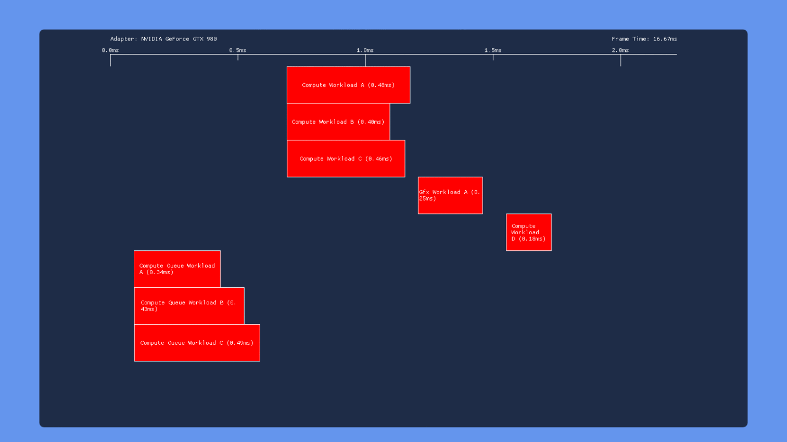

# 06 重叠和抢占实验

[Part1-什么是barrier](breaking_down_barriers_1.md)  
[Part2-GPU线程同步](breaking_down_barriers_2.md)  
[Part3-多核心处理器](breaking_down_barriers_3.md)  
[Part4-GPU抢占](breaking_down_barriers_4.md)  
[Part5-回到真实世界](breaking_down_barriers_5.md)  
[Part6-重叠和抢占实验](breaking_down_barriers_6.md)  

前面的篇幅介绍了“barriers”的工作原理，以及多硬件队列如何改善GPU线程竞争和吞吐量。这篇文章理论结合实践，通过[示例程序](https://github.com/TheRealMJP/OverlappedExecution)使用DXD12在Windows10上运行测试。

为了测试需要趁手的工具来检验不同的硬件使用DX12对显示任务同步以及多队列功能。不同硬件厂商提供工具可以捕获一段时间内的数据，但是没有显示不同任务之间在GPU上的同步竞争。PIX for Windows可以查看一段时间内任务在GPU上的竞争，但在当时还没发布，并且不能显示计算队列上的任务竞争，还有就是只能分析显示离线数据。(AMD后来有非常棒的工具[GPU profile](https://gpuopen.com/gaming-product/radeon-gpu-profiler-rgp/)，不仅显示任务在GPU上的并行运行，同时也显示对barriers的响应，但在写这篇文章时，这个工具还没发布)。

因此只能自己打造工具来测试。D3D12通过[timestamp queries](https://msdn.microsoft.com/en-us/library/windows/desktop/dn903946(v=vs.85).aspx)提供了内部机制来追踪GPU运行时间。这个用来追踪粗粒度的运行时间有用，比如GPU帧渲染时间，或者非透明组渲染时长。对于GPU线程级别的时间，不同硬件驱动返回的值各不相同，所以决定自己造轮子。

通过添加一块GPU可写内存，shader在自己的开始和结束写入内存位，然后在CPU端判断内存值变化来获取GPU端任务运行时间线。添加如下类型的内存块来做这件事：
```C++
D3D12_HEAP_DESC heapDesc = { };
heapDesc.SizeInBytes = 128 * 1024;
heapDesc.Flags = D3D12_HEAP_FLAG_ALLOW_ONLY_BUFFERS;
heapDesc.Alignment = 0;
heapDesc.Properties.CPUPageProperty = D3D12_CPU_PAGE_PROPERTY_WRITE_COMBINE;
heapDesc.Properties.CreationNodeMask = 0;
heapDesc.Properties.MemoryPoolPreference = D3D12_MEMORY_POOL_L0;
heapDesc.Properties.Type = D3D12_HEAP_TYPE_CUSTOM;
heapDesc.Properties.VisibleNodeMask = 0;
DXCall(DX12::Device->CreateHeap(&heapDesc, IID_PPV_ARGS(&workload.ReadbackHeap)));
```

设置 **CPUPageProperty** 为WRITE_COMBINE保证从CPU方面不缓存，这就使内存只能通过GPU写入而不是CPU写入。使用**MEMORY_POOL_L0**来让内存块分配在系统内存里而不是显存里，这保证CPU可以访问这块内存。同时这个参数设置GPU写入数据时不写入缓存，直接写入这块内存，这可以让CPU及时读取GPU写入数据，而不是还要等待GPU缓存刷新。最终保证整个过程是实时的，唯一的延迟就是GPU和CPU的通信之间。

其它关键部分是让第一个线程将值写入“start” buffer，最后一个线程将值写入“end” buffer。API不能保证线程的先后执行顺序，所以不能依赖SV_DispatchThreadID或者SV_Position去探测第一个和最后一个调用，所以使用全局变量通过原子操作来获取每个线程的调用索引：
```shader
uint prevValue = 0;
CounterBuffer.InterlockedAdd(0, 1, prevValue);
if(prevValue == 0)
ShaderStartBuffer[0] = CBuffer.FrameNum;
 
// Do actual shader workload
 
if(prevValue + 1 == CBuffer.NumWorkloadElements)
ShaderEndBuffer[0] = CBuffer.FrameNum;
```
在start/end buffers写入帧数因此它们将持续增加计数，从而避免每帧清理。

记录单帧工作任务耗费时间通用流程如下：

* 使用`ClearUnoderedAccessViewUint`命令将CounterBuffer置零
* 发出`draw/dispatch`命令
* 将UI绘制在back buffer
* 通知direct queue 等待fence，这个fence用来在GPU在执行任务前等待向GPU发送信号
* 向direct queue 提交命令列表
* 呈递
* 下一帧
* 等待最后的呈递完成，使用swap chiain waitable object（便随着VSYNC结束，同步CPU线程）
* 通知fence放行CPU，让执行上一帧提交的任务
* 循环检查start buffer的值，记录值修改时的时间
* 循环检查end buffer的值，记录值修改的时间
* 提交下一帧的命令

好消息是这个思路可行！在实现和测试后，最终结果时间变量似乎是合理的并且和通过查询timestamp所得到的值大致匹配（同样使用PIX查看了对应的时间，同样验证了我的结果）。从这开始，我添加了简单的框架用来添加系列dispatch和draw calls在 DIRECT和COMPUTE队列。我同样添加一些设置允许用户可以打开/关闭工作包，配置每个工作包可以加载的线程数量以及每个线程的需要做的工作量，同时指出以转换barriers为依赖的结果。以下是最终UI样子：

<p align="center">

</p>

对于单工作包，设置说明如下：

* “Num Groups” 滑动条控制每个工作包加载的线程数，以1024为增量。对于 compute 工作包控制dispatch的数量，同时对于graphic工作包控制视窗大小简洁的配置需要执行的像素shader数量。
* “Num Iteration” 滑动条指出在shader内部循环次数。循环体的工作是使用输入输出buffer计算柏perlin噪音
  
在应用程序设置窗口，这里有几个全局设置：

* VSYNC 可以打开或关闭
* 一个可以放大缩小时间线的滑动条
* “Use Split Barriers”设置导致app使用拆分转换barriers而不是标准barriers来解决依赖
* 在发送draw/dispatch之后，依赖的“开始”barriers立刻发送
* 在发送draw/dispatch之前，依赖的“结束”barriers立刻发送（如果拆分barriers禁止，独立转换barriers在draw/dispatch发送前立刻发送）
* 切换[stable power state](https://msdn.microsoft.com/en-us/library/windows/desktop/dn903835(v=vs.85).aspx)保证一致的GPU时钟，同样这个设置会让compute队列上的工作包提交到被[D3D12_COMMAND_QUEUE_PRIORITY_HIGH](https://msdn.microsoft.com/en-us/library/windows/desktop/dn986723(v=vs.85).aspx)创建的队列

## 结果
我在家里电脑测试了4个GPU：Nvidia Titan V（Volta），an Nvidia GTX 1070（Pascal），an AMD RX 460（Polaris，GCN Gen4)，以及Intel HD Graphics 530，这个是Core i7 6700k CPU（Gen9，Skylake）的集成显卡。还在工作电脑上测试了GTX 980。我调整了每个GPU独立工作包的线程数量尝试用来统计其执行单元数量的差异。所有的Nvidia GPU每个工作包使用8k线程，RX 460使用4k，Intel GPU使用2k。以下是我用来测试的情景：

* **默认** - app的默认设置。所有的工作包打开，在同一队列上顺序工作包互相有依赖关系。这可以展示Direct/Dispatch上的任务在独立的链条上并行运行的能力
* **No Barriers** - 所有的barriers关闭，这可以展示在同一队列上的任务并行运行的能力
* **Three Dispatch** - 三个dispatches提交到DIRECT 队列，第三个Dispatch依赖于第一个Dispatch。第二个Dispatch比第一个运行时间长，这展示了来自barriers的同步粒度
* **Three Dispatch,Split Barrier** - 和上面一样，除了使用拆分barrier。这个展示 driver/GPU能否利用拆分barriers在这种特殊情况下增加工作包的重叠调用
* **High-Priority Compute** - 和默认的一样，除了compute 队列工作包提交到更高优先级 COMPUTE 队列

### 默认

<p style="text-align:center;">Nvidia GTX 980</p>


<p style="text-align:center;">Nvidia GTX 1070</p>


<p style="text-align:center;">Nvidia Titan V</p>


<p style="text-align:center;">Intel HD 530</p>


<p style="text-align:center;">AMD RX 460</p>

在所有的案例里我们看到了所期盼的对应每个工作包之间有barriers时所表现的：所有的在同一队列的draws/dispatch没有重叠运行。然而我们同时发现GPU对模拟提交的任务在DIRECT和COMPUTE队列上的表现不同。

* 980貌似是从两个队列序列化工作，在执行完COMPUTE提交任务后，开始执行DIRECT的任务。
* 1070有一些叠加，在COMPUTE队列上的任务执行时间存在着奇怪的巨大缝隙，同时发现工作包重叠执行花费了更长的时间，证明重叠dispatches或draws 在竞争共享资源。
* Titan V和1070结果差不多，尽管空隙小了很多。
* Intel‘s GPU同样序列化了两个任务，这也是我们期望得到的，因为GPUView显示它没有COMPUTE 队列
* RX460完全重叠执行任务，没有奇怪的缝隙，这和我们根据AMD宣传材料以及开发者声称的“async compute”所期待的一样

一件值得注意的结果是Nvidia和AMD的GPU在graphic工作包后面都有一个明显的空隙，那个空隙是用来绘制一个渲染目标。这证明渲染目标barrier结果在post-shader上花费了更多工作量相对dispatch，也许因为ROP和cache activity有关。

### NO BARRIERES


<p style="text-align:center;">Nvidia GTX 980</p>


<p style="text-align:center;">Nvidia GTX 1070</p>


<p style="text-align:center;">Nvidia Titan V</p>


<p style="text-align:center;">Intel HD 530</p>


<p style="text-align:center;">AMD RX 460</p>

表现总结如下：

* 980和1070 GPU在这个例子里表现基本一致，前三个dispatches在每个队列上互相叠加运行的很好，但是在GRAPHIC队列上dispatches拒绝和在graphic工作包里的draw all 并行运行。这是不幸的，这证明了graphic和compute之间切换操作成本。我在两个GPU上试了很多方案，最终还是没有让dispatches和draw call 在graphic队列上并行运行。多个draw并行运行没问题，但是从compute切换到graphic（或者反过来）总是存在着隐性的同步点。
* Titan V 对前三个dispatches分别在DIRECT和COMPUTE队列上并行执行管理的很好，但是有同样的问题，dispatches和draw不并行运行
* Intel表现基本一样 ，dispatches重叠运行了一部分，但dispatches和draw还是不能并行运行
* 与此同时AMD维护了它的”重叠之王“的称号，无论在啥情况下都没有明显的同步点。同时发现移出barriers之后运行时间从2.5ms降到了1.5ms

### THREE DISPATCHES


<p style="text-align:center;">Nvidia GTX 980</p>


<p style="text-align:center;">Nvidia GTX 1070</p>


<p style="text-align:center;">Nvidia Titan V</p>


<p style="text-align:center;">Intel HD 530</p>


<p style="text-align:center;">AMD RX 460</p>

这次所有的GPU测试结果基本都相同：在dispatch c之前dispatch A执行结果后插入一个转换barrier，让dispatch c等待dispatch a的执行结果。这证明三个厂商实现write->read barrier使用全管线刷新。


<p style="float: left"><a href="breaking_down_barriers_5.md">Pre</a></p>