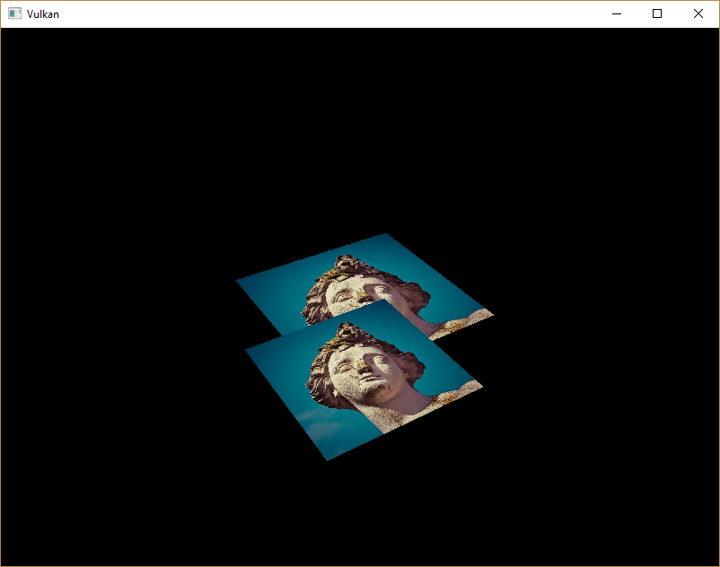

# Depth buffering
## 简介
本章为3d网格坐标加上Z坐标，然后通过展示没有经过深度排序的集合模型出现的问题。

## 3d 几何体
修改`Vertex`结构体使用3d向量来定义位置，并且修改`VkVertexInputAttributeDescription`中的`format`成员。

```C++
struct Vertex {
    glm::vec3 pos;
    glm::vec3 color;
    glm::vec2 texCoord;

    ...

    static std::array<VkVertexInputAttributeDescription, 3> getAttributeDescriptions() {
        std::array<VkVertexInputAttributeDescription, 3> attributeDescriptions{};

        attributeDescriptions[0].binding = 0;
        attributeDescriptions[0].location = 0;
        attributeDescriptions[0].format = VK_FORMAT_R32G32B32_SFLOAT;
        attributeDescriptions[0].offset = offsetof(Vertex, pos);

        ...
    }
};
```

接下来修改Vertex shader，使其使用3d坐标作为输入。

```GLSL
layout(location = 0) in vec3 inPosition;

...

void main() {
    gl_Position = ubo.proj * ubo.view * ubo.model * vec4(inPosition, 1.0);
    fragColor = inColor;
    fragTexCoord = inTexCoord;
}
```

最后修改变量`vertices`容器包含Z坐标：

```C++
const std::vector<Vertex> vertices = {
    {{-0.5f, -0.5f, 0.0f}, {1.0f, 0.0f, 0.0f}, {0.0f, 0.0f}},
    {{0.5f, -0.5f, 0.0f}, {0.0f, 1.0f, 0.0f}, {1.0f, 0.0f}},
    {{0.5f, 0.5f, 0.0f}, {0.0f, 0.0f, 1.0f}, {1.0f, 1.0f}},
    {{-0.5f, 0.5f, 0.0f}, {1.0f, 1.0f, 1.0f}, {0.0f, 1.0f}}
};
```

运行程序后结果保持不变，现在新加一个四边形，具体位置和表现如下：


添加新的四边形，Z轴调为`-0.5f`，然后添加对应三角形顶点索引：

```C++
const std::vector<Vertex> vertices = {
    {{-0.5f, -0.5f, 0.0f}, {1.0f, 0.0f, 0.0f}, {0.0f, 0.0f}},
    {{0.5f, -0.5f, 0.0f}, {0.0f, 1.0f, 0.0f}, {1.0f, 0.0f}},
    {{0.5f, 0.5f, 0.0f}, {0.0f, 0.0f, 1.0f}, {1.0f, 1.0f}},
    {{-0.5f, 0.5f, 0.0f}, {1.0f, 1.0f, 1.0f}, {0.0f, 1.0f}},

    {{-0.5f, -0.5f, -0.5f}, {1.0f, 0.0f, 0.0f}, {0.0f, 0.0f}},
    {{0.5f, -0.5f, -0.5f}, {0.0f, 1.0f, 0.0f}, {1.0f, 0.0f}},
    {{0.5f, 0.5f, -0.5f}, {0.0f, 0.0f, 1.0f}, {1.0f, 1.0f}},
    {{-0.5f, 0.5f, -0.5f}, {1.0f, 1.0f, 1.0f}, {0.0f, 1.0f}}
};

const std::vector<uint16_t> indices = {
    0, 1, 2, 2, 3, 0,
    4, 5, 6, 6, 7, 4
};
```
运行程序后，后发现类似于Escher插图的效果：



问题是在低位的四边形片元遮住了高位四边形片元，原因是低位四边形比高位四边形绘制的晚。解决问题的方案如下：

* 按照深度值从前往后排所有draw call
* 使用depth buffer来检测

第一种方案通常用来绘制透明物体，因为顺序相关的透明物体绘制是非常有挑战的问题。通过深度排序片元的问题，使用*depth buffer*是通用解决方案。*depth buffer*是位置额外的附件，用来存储深度信息，正如颜色附件用来存储每个位置的颜色信息。每当rasterizer生成一个片元，深度测试将检测新的片元是否比上一个片元更加接近相机。如果不是，新的片元被舍弃。通过检测的片元将自己的深度写入depth buffer。正如在片元shader里操作颜色值一样，也可以操作深度值。

```C++
#define GLM_FORCE_RADIANS
#define GLM_FORCE_DEPTH_ZERO_TO_ONE
#include <glm/glm.hpp>
#include <glm/gtc/matrix_transform.hpp>
```
由GLM生成的透视投影矩阵将会默认使用OpenGL的深度范围`[-1.0, 1.0]`，我们需要使用`GLM_FORCE_DEPTH_ZERO_TO_ONE`来让深度值匹配Vulkan的`[0.0, 1.0]`。

## Depth image and view
深度附件也是通过image来实现，正如颜色附件。区别是swap chain不自动生成深度image。这里仅需单个深度image，因为每次只能运行一个绘制操作。深度image需要三和一资源：image，memory，以及image view。

```C++
VkImage depthImage;
VkDeviceMemory depthImageMemory;
VkImageView depthImageView;
```

新建函数`createDepthResources`设置资源：

```C++
void initVulkan() {
    ...
    createCommandPool();
    createDepthResources();
    createTextureImage();
    ...
}

...

void createDepthResources() {

}
```

创建depth image 显而易见和颜色附件一样的分辨率，通过swap chain的范围来定义，使用image更加适合depth附件，因为对*平铺的优化(optimal tiling)* 以及本地内存。唯一的问题是：depth image最合适的格式是什么？格式必须包含depth组件，使用`_D??_`在`VK_FORMAT_`中标记。

和texture image不同的是，这里不需要特定的格式，因为程序里不直接访问texels。只需要合适的精度，在真实世界里至少需要`24`bit。以下几种格式满足要求：

* `VK_FORMAT_D32_SFLOAT`：32-bit浮点存储深度值
* `VK_FORMAT_D32_SFLOAT_S8_UINT`：32-bit有符号浮点存储深度值，8-bit模板组件
* `VK_FORMAT_D24_UNORM_S8_UINI`：24-bit有符号浮点存储深度值，8-bit模板组件

模板组件用来模板测试，这可以和depth测试相结合组成新的测试。

直接使用`VK_FORMAT_D32_SFLOAT`格式最简单，因为大多数硬件都支持，但是最好为程序添加相关的功能来提高灵活性。所以添加函数`findSupportedFomat`，来检测一个按照通用到少见格式顺序排列的列表，得出最先支持的格式。

```C++
VkFormat findSupportedFormat(const std::vector<VkFormat>& candidates, VkImageTiling tiling, VkFormatFeatureFlags features) {

}
```

支持格式依赖tiling的模式和使用方式，因此也需要此参数。支持的格式可以通过`vkGetPhysicalDeviceFormatProperties`来查询。

```C++
VkFormat findSupportedFormat(const std::vector<VkFormat>& candidates, VkImageTiling tiling, VkFormatFeatureFlags features) {
    for (VkFormat format : candidates) {
        // 有三个成员
        // linearTilingFeatures：支持线性tiling
        // optimalTilingFeatures：优化tiling
        // bufferFeatures：支持buffers
        VkFormatProperties props;
        vkGetPhysicalDeviceFormatProperties(physicalDevice, format, &props);

        if (tiling == VK_IMAGE_TILING_LINEAR && (props.linearTilingFeatures & features) == features) {
            return format;
        } else if (tiling == VK_IMAGE_TILING_OPTIMAL && (props.optimalTilingFeatures & features) == features) {
            return format;
        }
    }

    throw std::runtime_error("failed to find supported format!");
}
```

通过此函数创建`findDepthFormat`帮助函数来为depth附件选择合适的格式：

```C++
VkFormat findDepthFormat() {
    return findSupportedFormat(
        {VK_FORMAT_D32_SFLOAT, VK_FORMAT_D32_SFLOAT_S8_UINT, VK_FORMAT_D24_UNORM_S8_UINT},
        VK_IMAGE_TILING_OPTIMAL,
        VK_FORMAT_FEATURE_DEPTH_STENCIL_ATTACHMENT_BIT
    );
}
```

参数`candidates`后两个参数包含stencil组件，暂时不使用，但在image转换需要这些组件时用得到。添加一个简单帮助函数来检查depth格式是否含有stencil组件：

```C++
bool hasStencilComponent(VkFormat format) {
    return format == VK_FORMAT_D32_SFLOAT_S8_UINT || format == VK_FORMAT_D24_UNORM_S8_UINT;
}
```

现在可以完善`createDepthResources`，首先查找格式，然后调用`createImage`和`createImageView`函数：

```C++
createImage(swapChainExtent.width, swapChainExtent.height, depthFormat, VK_IMAGE_TILING_OPTIMAL, VK_IMAGE_USAGE_DEPTH_STENCIL_ATTACHMENT_BIT, VK_MEMORY_PROPERTY_DEVICE_LOCAL_BIT, depthImage, depthImageMemory);
depthImageView = createImageView(depthImage, depthFormat);
```

但是`createImageView`函数中`subresource`字段固定为`VK_IMAGE_ASPECT_COLOR_BIT`，需要将其改为传入参数。

```C++
VkImageView createImageView(VkImage image, VkFormat format, VkImageAspectFlags aspectFlags) {
    ...
    viewInfo.subresourceRange.aspectMask = aspectFlags;
    ...
}
```

重构之后，将此参数调用的地方修改为：

```C++
swapChainImageViews[i] = createImageView(swapChainImages[i], swapChainImageFormat, VK_IMAGE_ASPECT_COLOR_BIT);
...
depthImageView = createImageView(depthImage, depthFormat, VK_IMAGE_ASPECT_DEPTH_BIT);
...
textureImageView = createImageView(textureImage, VK_FORMAT_R8G8B8A8_SRGB, VK_IMAGE_ASPECT_COLOR_BIT);
```

这就是创建depth image。不需要映射内容或将另一个image拷贝到此image。因为我们将在render pass的开始处清除其内容，正如颜色附件那样。

## 主动转换depth image
不需主动转换为depth附件需要的布局，因为在render pass里会做这件事。但这里还是描述一下流程。在`createDepthResource`后续调用函数`transitionImageLayout`：
```C++
transitionImageLayout(depthImage, depthFormat, VK_IMAGE_LAYOUT_UNDEFINED, VK_IMAGE_LAYOUT_DEPTH_STENCIL_ATTACHMENT_OPTIMAL);
```

因为不用关心depth image的初始内容，所以源布局使用`VK_IMAGE_LAYOUT_UNDEFINED`。这里需要更新一下函数`transitionImageLayout`来使用合适的`subresource aspect`：
```C++
if (newLayout == VK_IMAGE_LAYOUT_DEPTH_STENCIL_ATTACHMENT_OPTIMAL) {
    barrier.subresourceRange.aspectMask = VK_IMAGE_ASPECT_DEPTH_BIT;

    // 就算没有使用stencil组件，还是需要处理
    if (hasStencilComponent(format)) {
        barrier.subresourceRange.aspectMask |= VK_IMAGE_ASPECT_STENCIL_BIT;
    }
} else {
    barrier.subresourceRange.aspectMask = VK_IMAGE_ASPECT_COLOR_BIT;
}
```

最后添加正确访问遮罩和pipeline stages：

```C++
if (oldLayout == VK_IMAGE_LAYOUT_UNDEFINED && newLayout == VK_IMAGE_LAYOUT_TRANSFER_DST_OPTIMAL) {
    barrier.srcAccessMask = 0;
    barrier.dstAccessMask = VK_ACCESS_TRANSFER_WRITE_BIT;

    sourceStage = VK_PIPELINE_STAGE_TOP_OF_PIPE_BIT;
    destinationStage = VK_PIPELINE_STAGE_TRANSFER_BIT;
} else if (oldLayout == VK_IMAGE_LAYOUT_TRANSFER_DST_OPTIMAL && newLayout == VK_IMAGE_LAYOUT_SHADER_READ_ONLY_OPTIMAL) {
    barrier.srcAccessMask = VK_ACCESS_TRANSFER_WRITE_BIT;
    barrier.dstAccessMask = VK_ACCESS_SHADER_READ_BIT;

    sourceStage = VK_PIPELINE_STAGE_TRANSFER_BIT;
    destinationStage = VK_PIPELINE_STAGE_FRAGMENT_SHADER_BIT;
} else if (oldLayout == VK_IMAGE_LAYOUT_UNDEFINED && newLayout == VK_IMAGE_LAYOUT_DEPTH_STENCIL_ATTACHMENT_OPTIMAL) {
    barrier.srcAccessMask = 0;
    barrier.dstAccessMask = VK_ACCESS_DEPTH_STENCIL_ATTACHMENT_READ_BIT | VK_ACCESS_DEPTH_STENCIL_ATTACHMENT_WRITE_BIT;

    sourceStage = VK_PIPELINE_STAGE_TOP_OF_PIPE_BIT;
    destinationStage = VK_PIPELINE_STAGE_EARLY_FRAGMENT_TESTS_BIT;
} else {
    throw std::invalid_argument("unsupported layout transition!");
}
```

depth buffer将被读取用来depth检测判断fragment是否可见，当新的fragment写入时，depth也被写入。读取发生在`VK_PIPELINE_STAGE_EARLY_FRAGMENT_TESTS_BIT`阶段，写入发生在`VK_PIPELINE_STAGE_EARLY_FRAGMENT_TESTS_BIT`。需要选择最早管线阶段来匹配指定的操作，这样才能在需要是作为depth附件。

## Render pass
修改`createRenderPass`来包含depth附件。首先指定`VkAttachmentDescription`：

```C++
VkAttachmentDescription depthAttachment{};
depthAttachment.format = findDepthFormat();
depthAttachment.samples = VK_SAMPLE_COUNT_1_BIT;
depthAttachment.loadOp = VK_ATTACHMENT_LOAD_OP_CLEAR;
depthAttachment.storeOp = VK_ATTACHMENT_STORE_OP_DONT_CARE;
depthAttachment.stencilLoadOp = VK_ATTACHMENT_LOAD_OP_DONT_CARE;
depthAttachment.stencilStoreOp = VK_ATTACHMENT_STORE_OP_DONT_CARE;
depthAttachment.initialLayout = VK_IMAGE_LAYOUT_UNDEFINED;
depthAttachment.finalLayout = VK_IMAGE_LAYOUT_DEPTH_STENCIL_ATTACHMENT_OPTIMAL;
```

`format`需要和depth image一致。这次不需要关心存储depth data(storeOp)，因为当绘制结束后不在使用此数据。这可能使得硬件执行额外的优化。正如color buffer，不需要关心前置的depth内容，所以使用`VK_IMAGE_LAYOUT_UNDEFINED`作为`initialLayout`的值。

```C++
VkAttachmentReference depthAttachmentRef{};
depthAttachmentRef.attachment = 1;
depthAttachmentRef.layout = VK_IMAGE_LAYOUT_DEPTH_STENCIL_ATTACHMENT_OPTIMAL;
```

为首个(唯一一个)subpass添加附件的引用：

```C++
VkSubpassDescription subpass{};
subpass.pipelineBindPoint = VK_PIPELINE_BIND_POINT_GRAPHICS;
subpass.colorAttachmentCount = 1;
subpass.pColorAttachments = &colorAttachmentRef;
subpass.pDepthStencilAttachment = &depthAttachmentRef;
```

不像color附件，subpass仅需要单个depth(+stencil)附件。没必要在多个buffers上做depth测试。

```C++
std::array<VkAttachmentDescription, 2> attachments = {colorAttachment, depthAttachment};
VkRenderPassCreateInfo renderPassInfo{};
renderPassInfo.sType = VK_STRUCTURE_TYPE_RENDER_PASS_CREATE_INFO;
renderPassInfo.attachmentCount = static_cast<uint32_t>(attachments.size());
renderPassInfo.pAttachments = attachments.data();
renderPassInfo.subpassCount = 1;
renderPassInfo.pSubpasses = &subpass;
renderPassInfo.dependencyCount = 1;
renderPassInfo.pDependencies = &dependency;
```

最终，更新`VkRenderPassCreateInfo`结构体引用所有附件。

## Framebuffer
下一步是修改framebuffer的创建来绑定depth image到depth附件。在函数`createFramebuffers`，指定depth image view作为第二个附件。

```C++  
std::array<VkImageView, 2> attachments = {
    swapChainImageViews[i],
    depthImageView
};

VkFramebufferCreateInfo framebufferInfo{};
framebufferInfo.sType = VK_STRUCTURE_TYPE_FRAMEBUFFER_CREATE_INFO;
framebufferInfo.renderPass = renderPass;
framebufferInfo.attachmentCount = static_cast<uint32_t>(attachments.size());
framebufferInfo.pAttachments = attachments.data();
framebufferInfo.width = swapChainExtent.width;
framebufferInfo.height = swapChainExtent.height;
framebufferInfo.layers = 1;
```

color附件伴随着每个swap chain image而改变，但同一个depth image一直共用，因为由于semaphores，同一时间只有一个subpass在运行。

还需要在depth image view真正创建之后调用`createFramebuffers`：

```C++
void initVulkan() {
    ...
    createDepthResources();
    createFramebuffers();
    ...
}
```

## Clear values
因为`VK_ATTACHMENT_LOAD_OP_CLEAR`对应多个附件，所以需要指定多个清理值。到函数`createCommandBuffers`里创建`VkClearValue`结构体数据：

```C++
std::array<VkClearValue, 2> clearValues{};
clearValues[0].color = {0.0f, 0.0f, 0.0f, 1.0f};
clearValues[1].depthStencil = {1.0f, 0};

renderPassInfo.clearValueCount = static_cast<uint32_t>(clearValues.size());
renderPassInfo.pClearValues = clearValues.data();
```

在vulkan的depth buffer中depth的范围是`[0, 1.0]`，`1.0`在远视面，`0.0`在近视面。在depth buffer中每个点对应`1.0`为其初始值。

需要注意的是申明`clearValues`的顺序和附件的顺序一致。

## Depth and stencil state
depth附件已经准备好被使用，但depth testing还需要在图形管线中开启。通过结构体`VkPipelineDepthStencilStateCreateInfo`来创建：

```C++
VkPipelineDepthStencilStateCreateInfo depthStencil{};
depthStencil.sType = VK_STRUCTURE_TYPE_PIPELINE_DEPTH_STENCIL_STATE_CREATE_INFO;
// 新的fragment的深度值是否和depth buffer中的深度值比较来确定是否舍弃新的fragment color
depthStencil.depthTestEnable = VK_TRUE;
// 是否将通过检测fragment的深度值写入buffer。这在绘制透明物件是有用，它们可以和非透明物体比较深度，但是不能让更远方的透明物体不绘制
depthStencil.depthWriteEnable = VK_TRUE;
// 指定舍弃fragment的判断方法，此处是更近的fragment绘制
depthStencil.depthCompareOp = VK_COMPARE_OP_LESS;

// 是否开启边界检测，指定最小边界和最大边界
depthStencil.depthBoundsTestEnable = VK_FALSE;
depthStencil.minDepthBounds = 0.0f; // Optional
depthStencil.maxDepthBounds = 1.0f; // Optional

// stencil buffer检测参数，如果开启stencil检测，需要depth/stencil image包含stencil组件
depthStencil.stencilTestEnable = VK_FALSE;
depthStencil.front = {}; // Optional
depthStencil.back = {}; // Optional

// 最后引用depth stencil state，如果render pass包含depth stencil附件，必须指定 depth stencil state
pipelineInfo.pDepthStencilState = &depthStencil;
```

现在运行程序，渲染次序为正确的。

## Handing window resize
depth buffer的分辨率伴随着窗口的尺寸改变而修改来匹配新的颜色附件的分辨率。扩展`recreateSwapChain`函数在此种情形下来重建depth资源：

```C++
void recreateSwapChain() {
    int width = 0, height = 0;
    while (width == 0 || height == 0) {
        glfwGetFramebufferSize(window, &width, &height);
        glfwWaitEvents();
    }

    vkDeviceWaitIdle(device);

    cleanupSwapChain();

    createSwapChain();
    createImageViews();
    createRenderPass();
    createGraphicsPipeline();
    createDepthResources();
    createFramebuffers();
    createUniformBuffers();
    createDescriptorPool();
    createDescriptorSets();
    createCommandBuffers();
}
```

清理操作也需要在swap chain清理函数中：

```C++
void cleanupSwapChain() {
    vkDestroyImageView(device, depthImageView, nullptr);
    vkDestroyImage(device, depthImage, nullptr);
    vkFreeMemory(device, depthImageMemory, nullptr);

    ...
}
```
[返回](../README.md)