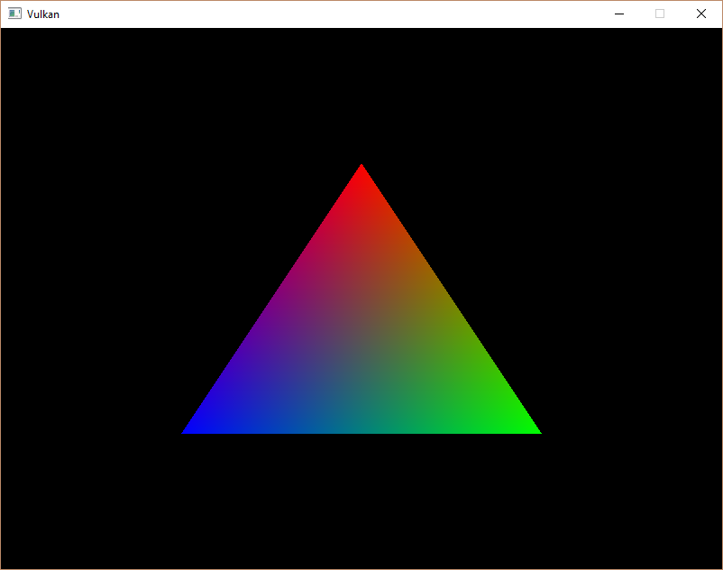

# Drawing
## Framebuffers
在渲染批次创建过程指定的附件通过封装在`VkFramebuffer`来整合。framebuffer对象索引代表所有附件的`VkImageView`对象。当前只有一个颜色附件，然而我们图像来自swapchain，所以要为所有从swapchain里获取的图像创建framebuffer，然后在渲染时选择一个合适的framebuffer。

定义存储framebuffer的变量如下：
```C++
std::vector<VkFramebuffer> swapChainFramebuffers;
```

创建framebuffer如下：

```C++
for (size_t i = 0; i < swapChainImageViews.size(); i++) {
    VkImageView attachments[] = {
        swapChainImageViews[i]
    };

    VkFramebufferCreateInfo framebufferInfo = {};
    framebufferInfo.sType = VK_STRUCTURE_TYPE_FRAMEBUFFER_CREATE_INFO;
    framebufferInfo.renderPass = renderPass;
    framebufferInfo.attachmentCount = 1;
    framebufferInfo.pAttachments = attachments;
    framebufferInfo.width = swapChainExtent.width;
    framebufferInfo.height = swapChainExtent.height;
    framebufferInfo.layers = 1;

    if (vkCreateFramebuffer(device, &framebufferInfo, nullptr, &swapChainFramebuffers[i]) != VK_SUCCESS) {
        throw std::runtime_error("failed to create framebuffer!");
    }
}
```
首先指定兼容的`renderPass`，兼容framebuffer的批次大概就是使用附件的数量以及附件尺寸一致。

`pAttachments`指向`swapChainImageViews`，`layers`指定framebuffer用到的层数，这里绘制2d图形，所以为一层。
## Command buffers
在Vulkan里绘制操作和内存转移操作不可以直接调用函数，而是使用命令。因此想执行命令需要将所有操作录制到到命令缓存对象中。优点是所有复杂的绘制命令可以提前设置并且使用多线程。之后只需告知Vulkan执行命令缓存对象即可。

### 命令池(Command pools)
在我们创建命令缓存前需要创建命令池。命令池管理保存缓存的内存以及分配出的命令缓存对象。命令池类型为`VkCommandPool`。创建命令池如下：

```C++
QueueFamilyIndices queueFamilyIndices = findQueueFamilies(physicalDevice);

VkCommandPoolCreateInfo poolInfo = {};
poolInfo.sType = VK_STRUCTURE_TYPE_COMMAND_POOL_CREATE_INFO;
poolInfo.queueFamilyIndex = queueFamilyIndices.graphicsFamily.value();
poolInfo.flags = 0; // Optional
```

通过将命令缓存提交到一个设备队列里来执行，比如获取到的图形和呈现队列。每个命令池分配出的命令缓存只能提交到对应单个类型队列。这里录制的命令用来绘制，因此选择图形队列家族。

命令池有两种类型的`flags`：

* `VK_COMMAND_POOL_CREATE_TRANSIENT_BIT`：标记命令缓存使用新的命令录制非常频繁(可能修改内存分配行为)
* `VK_COMMAND_POOL_CREATE_RESET_COMMAND_BUFFER_BIT`：允许命令缓存单独录制，没有此标记，所有的命令缓存必须一起重置

这里仅仅在程序开头录制命令缓存，然后在主循环里执行几次，这里不适用标记。创建命令池如下：

```C++
if (vkCreateCommandPool(device, &poolInfo, nullptr, &commandPool) != VK_SUCCESS) {
    throw std::runtime_error("failed to create command pool!");
}
```

### 命令缓存分配(command buffer allocation)
命令缓存是每个framebuffer对应一个，代码如下：

```C++
VkCommandBufferAllocateInfo allocInfo = {};
allocInfo.sType = VK_STRUCTURE_TYPE_COMMAND_BUFFER_ALLOCATE_INFO;
allocInfo.commandPool = commandPool;
allocInfo.level = VK_COMMAND_BUFFER_LEVEL_PRIMARY;
allocInfo.commandBufferCount = (uint32_t) commandBuffers.size();

if (vkAllocateCommandBuffers(device, &allocInfo, commandBuffers.data()) != VK_SUCCESS) {
    throw std::runtime_error("failed to allocate command buffers!");
}
```

`level`参数指定是否分配的命令缓存是主要的还是次要的命令缓存。

* `VK_COMMAND_BUFFER_LEVEL_PRIMARY`：可以提交到队列上执行，但不能从别的命令缓存调用
* `VK_COMMAND_BUFFER_LEVEL_SECONDARY`：不能直接提交，但可以从主命令缓存调用

这里不适用次命令缓存的功能，但是可以共用主命令缓存的操作。

### 开始命令缓存录制
录制命令缓存代码如下：

```C++
for (size_t i = 0; i < commandBuffers.size(); i++) {
    VkCommandBufferBeginInfo beginInfo = {};
    beginInfo.sType = VK_STRUCTURE_TYPE_COMMAND_BUFFER_BEGIN_INFO;
    beginInfo.flags = 0; // Optional
    beginInfo.pInheritanceInfo = nullptr; // Optional

    if (vkBeginCommandBuffer(commandBuffers[i], &beginInfo) != VK_SUCCESS) {
        throw std::runtime_error("failed to begin recording command buffer!");
    }
}
```

`flags`参数指定如何使用命令缓存，有以下值可使用：

* `VK_COMMAND_BUFFER_USAGE_ONE_TIME_SUBMIT_BIT`：命令缓存执行后立刻录制
* `VK_COMMAND_BUFFER_USAGE_RENDER_PASS_CONTINUE_BIT`：这是次级命令缓存，将单独用在一个渲染批次
* `VK_COMMAND_BUFFER_USAGE_SIMULTANEOUS_USE_BIT`：命令缓存已经在排队执行中，依然可以再次提交

`pInheritanceInfo`参数只和次命令缓存关联。它指定从正在调用的主命令缓存继承那些状态。

如果命令缓存已经录制过一次，然后调用`vkBeginCommandBuffer`会立马隐式的重置命令缓存。所以在此调用此命令的后续不可能增加新的命令。

### 开始渲染批次
绘制从渲染批次开始：

```C++
VkRenderPassBeginInfo renderPassInfo = {};
renderPassInfo.sType = VK_STRUCTURE_TYPE_RENDER_PASS_BEGIN_INFO;
renderPassInfo.renderPass = renderPass;
renderPassInfo.framebuffer = swapChainFramebuffers[i];

renderPassInfo.renderArea.offset = {0, 0};
renderPassInfo.renderArea.extent = swapChainExtent;
```
`renderArea`定义shader加载和执行的区域，在区域外的值未定义。当然和附件尺寸相匹配性能最优化。


```C++
VkClearValue clearColor = {0.0f, 0.0f, 0.0f, 1.0f};
renderPassInfo.clearValueCount = 1;
renderPassInfo.pClearValues = &clearColor;
```
`clearColor`定义了当加载颜色附件时使用参数`VK_ATTACHMENT_LOAD_OP_CLEAR`对应的清除值。

```C++
vkCmdBeginRenderPass(commandBuffers[i], &renderPassInfo, VK_SUBPASS_CONTENTS_INLINE);
```

所有录制命令函数都可以通过前缀`vkCmd`前缀来识别，因为所有的函数返回`void`，所以只到完成命令录制都没有错误异常处理。最后一个参数控制使用了渲染批次的绘制命令如何提供，有如下两种情况：

* `VK_SUBPASS_CONTENTS_INLINE`：渲染批次命令将嵌入到主命令缓存中并且没有次要缓存将被执行
* `VK_SUBPASS_CONTENTS_SECONDARY_COMMAND_BUFFERS`：渲染批次命令将从次要命令缓存执行

### 基础绘制命令
绑定图像管线：

```C++
vkCmdBindPipeline(commandBuffers[i], VK_PIPELINE_BIND_POINT_GRAPHICS, graphicsPipeline);
```

第二个参数指定是图形还是计算管线。当前已经设定了图形管线要执行的操作以及片元shader使用的附件，接下来则是绘制三角形：

```C++
// 参数一：命令缓存
// 参数二：顶点个数
// 参数三：批次个数，用在批渲染(instanced rendering)，如果不使用设置为1
// 参数四：顶点缓存步长，定义gl_VertexIndex的最小值
// 参数五：批次渲染步长，定义gl_InstanceIndex的最小值
vkCmdDraw(commandBuffers[i], 3, 1, 0, 0);
```

### 结束
渲染批次结束：

```C++
vkCmdEndRenderPass(commandBuffers[i]);
```

最后完成录制命令缓存：

```C++
if (vkEndCommandBuffer(commandBuffers[i]) != VK_SUCCESS) {
    throw std::runtime_error("failed to record command buffer!");
}
```

## Rendering and presentation

### 设置
万事俱备只欠东风，本节实现渲染，在主循环里添加了`drawFrame`函数。

```C++
void mainLoop() {
    while (!glfwWindowShouldClose(window)) {
        glfwPollEvents();
        drawFrame();
    }
}

...

void drawFrame() {

}
```
### 同步
`drawFrame`主要做三件事：

* 从交换链获取一张贴图
* 将命令缓存执行结果写入绑定在framebuffer上的贴图
* 渲染后的贴图返回交换链用来呈现到屏幕

每件事情通过单独的函数来执行，但是在函数返回后，每个函数涉及的功能并未执行完，这意味着三个函数的执行顺序是不确定的。但每个函数依赖前一个函数执行结果。

这里有两种方式来同步交换链事件：fences和semaphores。它们都可以用来协调操作，一个用作操作信号，另一个使用fences或semaphores从未收到信号到收到信号的状态改变来当做等待守护。

区别是fences的状态可以通过函数`vkWaitForFences`来访问，但semaphores不可以。Fences用来同步应用程序和渲染之间的操作，而semaphores用来同步同队列或跨队列命令。这里我们需要绘制命令和呈现需要同步，semaphores最适合不过了。

### semaphores
这里需要两个semaphores，一个用来通知已经获取到贴图并且为渲染阶段做好了准备，另一个来通知渲染完成，可以将贴图呈现到屏幕。创建semaphores流程如下：

```C++
void createSemaphores() {
    VkSemaphoreCreateInfo semaphoreInfo = {};
    semaphoreInfo.sType = VK_STRUCTURE_TYPE_SEMAPHORE_CREATE_INFO;

    if (vkCreateSemaphore(device, &semaphoreInfo, nullptr, &imageAvailableSemaphore) != VK_SUCCESS ||
    vkCreateSemaphore(device, &semaphoreInfo, nullptr, &renderFinishedSemaphore) != VK_SUCCESS) {

    throw std::runtime_error("failed to create semaphores!");
}
```

程序结束后需要清理semaphores：

```C++
void cleanup() {
    vkDestroySemaphore(device, renderFinishedSemaphore, nullptr);
    vkDestroySemaphore(device, imageAvailableSemaphore, nullptr);
}
```

### 从交换链获取一张贴图
从交换链获取一张贴图，因为交换链是扩展特性，所以使用的函数名字模式为`vk*KHR`:

```C++
void drawFrame() {
    uint32_t imageIndex;
    // 从交换链获取一张贴图
    // 参数一：逻辑设备
    // 参数二：交换链
    // 参数三：获取贴图超时时间
    // 参数四：当呈现引擎完成后，贴图可用的信号载体
    // 参数五：交换链里可用贴图的索引号
    vkAcquireNextImageKHR(device, swapChain, UINT64_MAX, imageAvailableSemaphore, VK_NULL_HANDLE, &imageIndex);
}
```

### 提交命令缓存(command buffer)
队列任务提交和同步通过使用结构体`VkSubmitInfo`来配置：

```C++
VkSubmitInfo submitInfo = {};
submitInfo.sType = VK_STRUCTURE_TYPE_SUBMIT_INFO;

VkSemaphore waitSemaphores[] = {imageAvailableSemaphore};
VkPipelineStageFlags waitStages[] = {VK_PIPELINE_STAGE_COLOR_ATTACHMENT_OUTPUT_BIT};
submitInfo.waitSemaphoreCount = 1;
// 这里设置等待信号，就是需要从交换链获取到贴图才继续进行
submitInfo.pWaitSemaphores = waitSemaphores;
// 在图形管线的写入阶段，需要设置等待到此阶段，stage的等待变量和semaphores的变量是一一对应的
submitInfo.pWaitDstStageMask = waitStages;

submitInfo.commandBufferCount = 1;
submitInfo.pCommandBuffers = &commandBuffers[imageIndex];
// 渲染结束通知信号
VkSemaphore signalSemaphores[] = {renderFinishedSemaphore};
submitInfo.signalSemaphoreCount = 1;
submitInfo.pSignalSemaphores = signalSemaphores;

// 最后一个参数为渲染结束通知信号fence，但是使用了 semaphores 不需要使用fence
if (vkQueueSubmit(graphicsQueue, 1, &submitInfo, VK_NULL_HANDLE) != VK_SUCCESS) {
    throw std::runtime_error("failed to submit draw command buffer!");
}
```

### Subpass 依赖
在渲染批次(render pass)里的子渲染批次(subpasses)自动管理贴图布局转换，这些转换被子批次依赖(subpass dependencies)控制，其指定子渲染批次之间的内存和执行依赖。就算只有一个子渲染批次，但子渲染批次的执行之前和执行之后的操作隐式的算作子渲染批次。

这里有两个内置的依赖来管理渲染批次开始和渲染批次结束后的转换，但是渲染批次开始的转换调用时机不对。这是因为这次转换发生在渲染管线开始的时候，但此刻还没有获取到贴图，这里有两种方式处理此问题。一种是修改`imageAvailableSemaphore`的`waitStage`为`VK_PIPELINE_STAGE_TOP_OF_PIPE_BIT`来保证当获取到贴图后开始渲染批次，另一种是让渲染批次等到`VK_PIPELINE_STAGE_TOP_OF_PIPE_BIT`阶段在开始执行。选择第二种方式的话，需要添加渲染批次的依赖。

```C++
VkSubpassDependency dependency = {};
// srcSubpass 被依赖的子渲染批次，VK_SUBPASS_EXTERNAL为隐式的子渲染批次
// dstSubpass 当前渲染批次，因为只有一个自渲染批次，所以是0
// dstSubpass 必须比srcSubpass 的值高，防止圆环依赖图(无线循环依赖)，除了使用 VK_SUBPASS_EXTERNAL
dependency.srcSubpass = VK_SUBPASS_EXTERNAL;
dependency.dstSubpass = 0;

// 这里指定等待的阶段，以及要等待的执行的操作，方可执行转换操作，所以依赖的子批次在此阶段，不需要等待
// 啥操作，即可执行转换
dependency.srcStageMask = VK_PIPELINE_STAGE_COLOR_ATTACHMENT_OUTPUT_BIT;
dependency.srcAccessMask = 0;

// 本次的子渲染批次等待的阶段，并且在执行完读和写之后，方可转换
dependency.dstStageMask = VK_PIPELINE_STAGE_COLOR_ATTACHMENT_OUTPUT_BIT;
dependency.dstAccessMask = VK_ACCESS_COLOR_ATTACHMENT_READ_BIT | VK_ACCESS_COLOR_ATTACHMENT_WRITE_BIT;

renderPassInfo.dependencyCount = 1;
renderPassInfo.pDependencies = &dependency;
```

### 呈现
最后一步是将渲染好的图像提交的swapchain来显示到屏幕上。

```C++
VkPresentInfoKHR presentInfo = {};
presentInfo.sType = VK_STRUCTURE_TYPE_PRESENT_INFO_KHR;

// 指定要要等待的信号，方可将图像提交到swapchain
presentInfo.waitSemaphoreCount = 1;
presentInfo.pWaitSemaphores = signalSemaphores;

// 指定要提交的swapchain，以及swapchain里对应的图像索引
VkSwapchainKHR swapChains[] = {swapChain};
presentInfo.swapchainCount = 1;
presentInfo.pSwapchains = swapChains;
presentInfo.pImageIndices = &imageIndex;

// 最后呈现后的结果，通过返回的结果数组来看呈现是否成功，这里暂不需要，因为呈现函数会返回结果值
presentInfo.pResults = nullptr; // Optional

vkQueuePresentKHR(presentQueue, &presentInfo);
```

执行之后将会看到渲染后的三角形：



当关闭程序后，从输出日志看到程序在退出时崩溃了，这是因为在程序退出时，渲染和呈现还在继续进行。所以退出时要等待这些操作完成。

```C++
void mainLoop() {
    while (!glfwWindowShouldClose(window)) {
        glfwPollEvents();
        drawFrame();
    }
    // 这里等待逻辑设备完成操作，也可以使用等待队列完成任务(vkQueueWaitIdle)
    vkDeviceWaitIdle(device);
}
```

### 帧并发(frame in flight)
如果观察程序运行所使用的的内存，会发现内存在不断上涨，这是因为CPU一直提交任务到GPU，但是GPU还未执行完，所以整个队列会不断慢慢增长。更糟糕的是每次提交的任务共同使用了`imageAvailableSemaphore`和`renderFinishedSemaphore`，这就导致信号错乱。

最简单解决方式是渲染完一帧，在进行渲染下一帧。

```C++
void drawFrame() {
    ...

    vkQueuePresentKHR(presentQueue, &presentInfo);

    vkQueueWaitIdle(presentQueue);
}
```

这种方式在呈现贴图时，CPU在等待状态，并不是高效使用CPU。所以要做到多帧并发渲染，同时限制向GPU渲染队列里提交的任务。

首先添加同时处理的帧数量：

```C++
const int MAX_FRAMES_IN_FLIGHT = 2;
```

每帧有自己的信号量：

```C++
std::vector<VkSemaphore> imageAvailableSemaphores;
std::vector<VkSemaphore> renderFinishedSemaphores;
```

这样在渲染时指定每帧自己的信号量，并且交替渲染。

```C++
void drawFrame() {
    ...

    currentFrame = (currentFrame + 1) % MAX_FRAMES_IN_FLIGHT;
}
```

这时做到了GPU-GPU的任务同步，但是CPU提交到GPU的任务还是没有限制。所以要添加CPU到GPU信号量来同步整个操作，这时引入前面提到的*fences*。首先为每一帧创建`fence`：

```C++
std::vector<VkSemaphore> imageAvailableSemaphores;
std::vector<VkSemaphore> renderFinishedSemaphores;
std::vector<VkFence> inFlightFences;
size_t currentFrame = 0;
```

然后渲染时传递信号量，等待渲染结束的信号量发送，在进行此帧的渲染：

```C++
void drawFrame() {
    // 在首次进入的时候，可以继续进行
    // 当渲染命令提交后，在运行到此，这里是同步操作，一致等到信号量接受到，方可继续执行
    vkWaitForFences(device, 1, &inFlightFences[currentFrame], VK_TRUE, UINT64_MAX);
    // 这里将信号量重置为未接受状态
    vkResetFences(device, 1, &inFlightFences[currentFrame]);

    ...
    if (vkQueueSubmit(graphicsQueue, 1, &submitInfo, inFlightFences[currentFrame]) != VK_SUCCESS) {
        throw std::runtime_error("failed to submit draw command buffer!");
    }
    ...
}
```

所以在创建*fence*时，首选要初始化为接受信号状态：

```C++
void createSyncObjects() {
    ...

    VkFenceCreateInfo fenceInfo = {};
    fenceInfo.sType = VK_STRUCTURE_TYPE_FENCE_CREATE_INFO;
    fenceInfo.flags = VK_FENCE_CREATE_SIGNALED_BIT;

    ...
}
```

现在内存泄露问题消失了，但是程序运行不正常。这是因为如果`MAX_FRAMES_IN_FLIGHT`大于交换链的贴图，或者`vkAcquireNextImageKHR`返回的贴图索引是乱序的，这就会导致每次渲染的贴图本身已经在使用中。为了避免这种情况，在使用交换链里贴图时，首先要确保对应的此次渲染完毕，方可使用此贴图。由于并不知道每张贴图对应的*fence*，所以需要数组来记录。

```C++
std::vector<VkFence> inFlightFences;
std::vector<VkFence> imagesInFlight;
size_t currentFrame = 0;
```

初始化：

```C++
std::vector<VkFence> inFlightFences;
std::vector<VkFence> imagesInFlight;
size_t currentFrame = 0;
```

渲染执行前，需要判断是否此贴图可以使用，如果不可使用，等待状态改变：

```C++
void drawFrame() {
    ...

    vkAcquireNextImageKHR(device, swapChain, UINT64_MAX, imageAvailableSemaphores[currentFrame], VK_NULL_HANDLE, &imageIndex);

    // Check if a previous frame is using this image (i.e. there is its fence to wait on)
    if (imagesInFlight[imageIndex] != VK_NULL_HANDLE) {
        vkWaitForFences(device, 1, &imagesInFlight[imageIndex], VK_TRUE, UINT64_MAX);
    }
    // Mark the image as now being in use by this frame
    imagesInFlight[imageIndex] = inFlightFences[currentFrame];

    ...
}
```

最后因为要等贴图状态是可使用，所以将*fence*状态充值修改到提交任务之前：

```C++
void drawFrame() {
    ...

    vkResetFences(device, 1, &inFlightFences[currentFrame]);

    if (vkQueueSubmit(graphicsQueue, 1, &submitInfo, inFlightFences[currentFrame]) != VK_SUCCESS) {
        throw std::runtime_error("failed to submit draw command buffer!");
    }

    ...
}
```