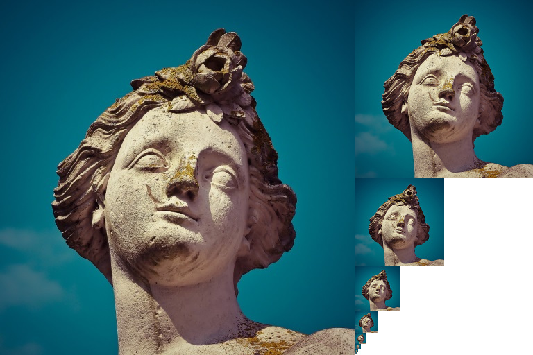

# Generating Mipmaps

## 简介
当前程序可以加载和渲染3d模型。本章添加新的特性，生成mipmap。Mipmap广泛的用在游戏和渲染软件中，Vulkan提供的接口让我们完全控制Mipmap的创建。

Mipmap是提前计算好，缩小版本的image。每个新的image的长和宽是上一个的一半。Mipmaps被用在*Level of Detail(LOD)*上。距离相机远的物件将会使用更小的mip images。使用更小的images提升渲染的速度同时避免*伪影(artifacts)*，比如[摩尔纹图案](https://en.wikipedia.org/wiki/Moir%C3%A9_pattern)。Mipmaps的例子如下图：



## Image 创建
在Vulkan中，每个mip images存储在不同*mip levels* `VkImage`。Mip level 0是源image，在level 0之后的通常指定为*mip chain*。

在`VkImage`创建时，Mip level需要指定。目前为止，都是设置为1。我们需要通过image的尺寸来计算mip level。首先定义一个值来存储它：

```C++
uint32_t mipLevels;
VkImage textureImage;
```

当在函数`createTextureImage`中加载texture后即可计算得到`mipLevels`的值：

```C++
int texWidth, texHeight, texChannels;
stbi_uc* pixels = stbi_load(TEXTURE_PATH.c_str(), &texWidth, &texHeight, &texChannels, STBI_rgb_alpha);
...
// max 获取宽度和高度中大的值
// log2 求以2为低的对数
// floor 舍弃小数点后的值
// 加1是因为没有mipmap时为1
mipLevels = static_cast<uint32_t>(std::floor(std::log2(std::max(texWidth, texHeight)))) + 1;
```

引入mip levels后，需要修改函数`createImage`，`createImageView`，`transitionImageLayout`来指定mip levels。为这些函数添加`mipLevels`参数：

```C++
void createImage(uint32_t width, uint32_t height, uint32_t mipLevels, VkFormat format, VkImageTiling tiling, VkImageUsageFlags usage, VkMemoryPropertyFlags properties, VkImage& image, VkDeviceMemory& imageMemory) {
    ...
    imageInfo.mipLevels = mipLevels;
    ...
}

VkImageView createImageView(VkImage image, VkFormat format, VkImageAspectFlags aspectFlags, uint32_t mipLevels) {
    ...
    viewInfo.subresourceRange.levelCount = mipLevels;
    ...
}

void transitionImageLayout(VkImage image, VkFormat format, VkImageLayout oldLayout, VkImageLayout newLayout, uint32_t mipLevels) {
...
barrier.subresourceRange.levelCount = mipLevels;
...
}
```

最后更新这些函数的调用：

```C++
createImage(swapChainExtent.width, swapChainExtent.height, 1, depthFormat, VK_IMAGE_TILING_OPTIMAL, VK_IMAGE_USAGE_DEPTH_STENCIL_ATTACHMENT_BIT, VK_MEMORY_PROPERTY_DEVICE_LOCAL_BIT, depthImage, depthImageMemory);
...
createImage(texWidth, texHeight, mipLevels, VK_FORMAT_R8G8B8A8_SRGB, VK_IMAGE_TILING_OPTIMAL, VK_IMAGE_USAGE_TRANSFER_DST_BIT | VK_IMAGE_USAGE_SAMPLED_BIT, VK_MEMORY_PROPERTY_DEVICE_LOCAL_BIT, textureImage, textureImageMemory);

swapChainImageViews[i] = createImageView(swapChainImages[i], swapChainImageFormat, VK_IMAGE_ASPECT_COLOR_BIT, 1);
...
depthImageView = createImageView(depthImage, depthFormat, VK_IMAGE_ASPECT_DEPTH_BIT, 1);
...
textureImageView = createImageView(textureImage, VK_FORMAT_R8G8B8A8_SRGB, VK_IMAGE_ASPECT_COLOR_BIT, mipLevels);

transitionImageLayout(depthImage, depthFormat, VK_IMAGE_LAYOUT_UNDEFINED, VK_IMAGE_LAYOUT_DEPTH_STENCIL_ATTACHMENT_OPTIMAL, 1);
...
transitionImageLayout(textureImage, VK_FORMAT_R8G8B8A8_SRGB, VK_IMAGE_LAYOUT_UNDEFINED, VK_IMAGE_LAYOUT_TRANSFER_DST_OPTIMAL, mipLevels);
```

## 生成MipMaps
texture image 当前有多个mip levels，但是staging buffer只能填充填充mip level 0。其它levels目前未定义。为了填充其它levels，我们需要从我们当前有的唯一level生成数据。这里将使用`vkCmdBlitImage`命令。此命令执行拷贝，放大缩小，以及筛选的功能。我们将多次调用此命令来*blit*数据到每个level的texture image。

`vkCmdBlit`是转移操作类型的函数，因此必须通知Vulkan我们将使用texture image作为转移的源和目标。在函数`createTextureImage`中使用`VK_IMAGE_USAGE_TRANSFER_SRC_BIT`当做texture image的usage flags。

```C++
...
createImage(texWidth, texHeight, mipLevels, VK_FORMAT_R8G8B8A8_SRGB, VK_IMAGE_TILING_OPTIMAL, VK_IMAGE_USAGE_TRANSFER_SRC_BIT | VK_IMAGE_USAGE_TRANSFER_DST_BIT | VK_IMAGE_USAGE_SAMPLED_BIT, VK_MEMORY_PROPERTY_DEVICE_LOCAL_BIT, textureImage, textureImageMemory);
...
```

正如其它image操作，`vkCmdBlitImage`依赖它所操作的image的布局。我们可以将整个image转换为`VK_IMAGE_LAYOUT_GENERAL`，但是这种布局不是最优。为了更加的性能，源image的布局应给为`VK_IMAGE_LAYOUT_TRANSFER_SRC_OPTIMAL`，目标image的布局应给为`VK_IMAGE_LAYOUT_TRANSFER_DST_OPTIMAL`。Vulkan允许独立的转换每个level的mipmap。每个blit每次仅处理两个mip等级，因此我们在这些blit command中间，可以将每个level的mip转换为最优布局。

`transitionImageLayout`仅在整个image上执行布局转换，所以需要增加几个管线barrier命令。移除`createTextureImage`中已存的转移`VK_IMAGE_LAYOUT_SHADER_READ_ONLY_OPIMAL`：

```C++
...
transitionImageLayout(textureImage, VK_FORMAT_R8G8B8A8_SRGB, VK_IMAGE_LAYOUT_UNDEFINED, VK_IMAGE_LAYOUT_TRANSFER_DST_OPTIMAL, mipLevels);
    copyBufferToImage(stagingBuffer, textureImage, static_cast<uint32_t>(texWidth), static_cast<uint32_t>(texHeight));
//transitioned to VK_IMAGE_LAYOUT_SHADER_READ_ONLY_OPTIMAL while generating mipmaps
...
```

这将导致每个level的texture image布局为`VK_IMAGE_LAYOUT_TRANSFER_DST_OPTIMAL`。每个level在blit命令从image读取完毕后，转换为`VK_IMAGE_LAYOUT_TRANSFER_DST_OPTIMAL`。

现在添加生成mipmaps的函数：

```C++
void generateMipmaps(VkImage image, int32_t texWidth, int32_t texHeight, uint32_t mipLevels) {
    VkCommandBuffer commandBuffer = beginSingleTimeCommands();

    VkImageMemoryBarrier barrier{};
    barrier.sType = VK_STRUCTURE_TYPE_IMAGE_MEMORY_BARRIER;
    barrier.image = image;
    barrier.srcQueueFamilyIndex = VK_QUEUE_FAMILY_IGNORED;
    barrier.dstQueueFamilyIndex = VK_QUEUE_FAMILY_IGNORED;
    barrier.subresourceRange.aspectMask = VK_IMAGE_ASPECT_COLOR_BIT;
    barrier.subresourceRange.baseArrayLayer = 0;
    barrier.subresourceRange.layerCount = 1;
    barrier.subresourceRange.levelCount = 1;

    endSingleTimeCommands(commandBuffer);
}
```

我们将执行几个转换，因此将复用`VkImageMemoryBarrier`。此次转换用到的`barrier`成员变量都为上面设置的值。`subResourceRange.mipLevel`, `oldLayout`, `newLayout`, `srcAccessMask` 以及`dstAcessMask`随着每次转换而改变：

```C++
int32_t mipWidth = texWidth;
int32_t mipHeight = texHeight;

// 此循环将录制每个VkCmdBlitImage命令，循环从1开始
for (uint32_t i = 1; i < mipLevels; i++) {
    barrier.subresourceRange.baseMipLevel = i - 1;
    barrier.oldLayout = VK_IMAGE_LAYOUT_TRANSFER_DST_OPTIMAL;
    barrier.newLayout = VK_IMAGE_LAYOUT_TRANSFER_SRC_OPTIMAL;
    barrier.srcAccessMask = VK_ACCESS_TRANSFER_WRITE_BIT;
    barrier.dstAccessMask = VK_ACCESS_TRANSFER_READ_BIT;

    vkCmdPipelineBarrier(commandBuffer,
        VK_PIPELINE_STAGE_TRANSFER_BIT, VK_PIPELINE_STAGE_TRANSFER_BIT, 0,
        0, nullptr,
        0, nullptr,
        1, &barrier);
    }
}
```
首先从`i-1`level转换到`VK_IMAGE_LAYOUT_TRANSFER_SRC_OPTIMAL`。此次转换将等待`i-1`被填充，此次填充是来自前一个blit命令，或者来自`vkCmdCopyBufferToImage`。当前blit命令将等待这次转换。

```C++
VkImageBlit blit{};
blit.srcOffsets[0] = { 0, 0, 0 };
blit.srcOffsets[1] = { mipWidth, mipHeight, 1 };
blit.srcSubresource.aspectMask = VK_IMAGE_ASPECT_COLOR_BIT;
blit.srcSubresource.mipLevel = i - 1;
blit.srcSubresource.baseArrayLayer = 0;
blit.srcSubresource.layerCount = 1;
blit.dstOffsets[0] = { 0, 0, 0 };
blit.dstOffsets[1] = { mipWidth > 1 ? mipWidth / 2 : 1, mipHeight > 1 ? mipHeight / 2 : 1, 1 };
blit.dstSubresource.aspectMask = VK_IMAGE_ASPECT_COLOR_BIT;
blit.dstSubresource.mipLevel = i;
blit.dstSubresource.baseArrayLayer = 0;
blit.dstSubresource.layerCount = 1;
```

接下来，我们将指定blit操作的区域。源mip level为`i-1`，目标mip level为`i`。`srcOffsets`数组的两个元素决定了blit的3d区域。`dstOffsets[1]`的X和Y值通过源mip level的宽度和高度除二取得。`srcOffsets[1]`和`dstOffsets[1]`的Z值皆为1，因为2d Image的深度为1。

```C++
vkCmdBlitImage(commandBuffer,
    image, VK_IMAGE_LAYOUT_TRANSFER_SRC_OPTIMAL,
    image, VK_IMAGE_LAYOUT_TRANSFER_DST_OPTIMAL,
    1, &blit,
    VK_FILTER_LINEAR);
```

现在录制了blit命令，可以看到`textureImage`同时用在了`srcImage`和`dstImage`参数。这是因为在blit同一个image的不同level。源mip level仅仅转换到`VK_IMAGE_LAYOUT_SRC_OPTIMAL`，并且来自`createTextureImage`的目标mip level仍然为`VK_IMAGE_LAYOUT_TRANSFER_DST_OPTIMAL`。

最后的参数让我们在使用blit指定`VkFilter`。这里使用我们已经在`VkSampler`用到的同一filtering选项。使用`VK_FILTER_LINEAR`来开启插值。

```C++
barrier.oldLayout = VK_IMAGE_LAYOUT_TRANSFER_SRC_OPTIMAL;
barrier.newLayout = VK_IMAGE_LAYOUT_SHADER_READ_ONLY_OPTIMAL;
barrier.srcAccessMask = VK_ACCESS_TRANSFER_READ_BIT;
barrier.dstAccessMask = VK_ACCESS_SHADER_READ_BIT;

vkCmdPipelineBarrier(commandBuffer,
    VK_PIPELINE_STAGE_TRANSFER_BIT, VK_PIPELINE_STAGE_FRAGMENT_SHADER_BIT, 0,
    0, nullptr,
    0, nullptr,
    1, &barrier);
```

这个barrier转换mip level `i-1`到`VK_IMAGE_LAYOUT_SHADER_READ_ONLY_OPTIMAL`。此次转换等待当前blit命令完成。所有的采样操作要等待此次转换完成。

```C++
        ...
        if (mipWidth > 1) mipWidth /= 2;
        if (mipHeight > 1) mipHeight /= 2;
    }
```

在循环的结尾，我们将当前的mip的尺寸除以二，在除以二之前，需要判断尺寸变为零。两边都判断，就是用来防止不是正方形的mip尺寸每一边最小值不为零。

```C++
    barrier.subresourceRange.baseMipLevel = mipLevels - 1;
    barrier.oldLayout = VK_IMAGE_LAYOUT_TRANSFER_DST_OPTIMAL;
    barrier.newLayout = VK_IMAGE_LAYOUT_SHADER_READ_ONLY_OPTIMAL;
    barrier.srcAccessMask = VK_ACCESS_TRANSFER_WRITE_BIT;
    barrier.dstAccessMask = VK_ACCESS_SHADER_READ_BIT;

    vkCmdPipelineBarrier(commandBuffer,
        VK_PIPELINE_STAGE_TRANSFER_BIT, VK_PIPELINE_STAGE_FRAGMENT_SHADER_BIT, 0,
        0, nullptr,
        0, nullptr,
        1, &barrier);

    endSingleTimeCommands(commandBuffer);
}
```

在结束command buffer之前，再插入一个pipeline barrier。此barrier将最后一个mip level从`VK_IMAGE_LAYOUT_TRANSFER_DST_OPTIMAL`转换到`VK_IMAGE_LAYOUT_TRANSFER_DST_OPTIMAL`。在循环中最后一个mip level没有被blited。

最终将`generateMipmaps`加到`createTextureImage`中：

```C++
transitionImageLayout(textureImage, VK_FORMAT_R8G8B8A8_SRGB, VK_IMAGE_LAYOUT_UNDEFINED, VK_IMAGE_LAYOUT_TRANSFER_DST_OPTIMAL, mipLevels);
    copyBufferToImage(stagingBuffer, textureImage, static_cast<uint32_t>(texWidth), static_cast<uint32_t>(texHeight));
//transitioned to VK_IMAGE_LAYOUT_SHADER_READ_ONLY_OPTIMAL while generating mipmaps
...
generateMipmaps(textureImage, texWidth, texHeight, mipLevels);
```
我们的texture image的mip map填充完毕。

## 线性filtering支持
使用类似于`vkCmdBlitImage`内置函数可以非常方便的生成所有的mip levels，但是不能保证所有的平台都支持。它需要我们使用的texture image格式支持线性filtering，可以通过`vkGetPhysicalDeviceFormatProperties`来检查。我们将在`generateMipmaps`函数里添加此项检查：

首先增加image格式的参数：

```C++
void createTextureImage() {
    ...

    generateMipmaps(textureImage, VK_FORMAT_R8G8B8A8_SRGB, texWidth, texHeight, mipLevels);
}

void generateMipmaps(VkImage image, VkFormat imageFormat, int32_t texWidth, int32_t texHeight, uint32_t mipLevels) {

    ...
}
```

在`generateMipmap`函数中，使用`vkGetPhysicalDeviceFormatProperties`来获取texture image格式的属性：

```C++
void generateMipmaps(VkImage image, VkFormat imageFormat, int32_t texWidth, int32_t texHeight, uint32_t mipLevels) {

    // Check if image format supports linear blitting
    VkFormatProperties formatProperties;
    vkGetPhysicalDeviceFormatProperties(physicalDevice, imageFormat, &formatProperties);

    ...
```

`VkFormatProperties`结构体有三项成员，分别是`linearTilingFeatures`，`optimalTilingFeatures`以及`bufferFeatures`，每一种特性描述了是否支持这种格式要使用的方式。我们创建了optimal tiling格式的texture image，因此我们需要检查`optimalTilingFeatures`。是否支持线性filtering特性，使用`VK_FORMAT_FEATURE_SAMPLED_IMAGE_FILTER_LINEAR_BIT`来检测：

```C++
if (!(formatProperties.optimalTilingFeatures & VK_FORMAT_FEATURE_SAMPLED_IMAGE_FILTER_LINEAR_BIT)) {
    throw std::runtime_error("texture image format does not support linear blitting!");
}
```

这里有两种替代方案。你可以实现一个函数所有支持linear bliting格式的texture image，或者在软件里使用类似于`stb_image_resize`的库实现mipmap的生成。然后每阶mip level的image使用和源image一样的加载方式加载。

值得注意的是，在实际的项目中很少有在运行时生成mip map的。通常都是预先生成，和原图放置在一起，这样可以提升加载效率。在软件中实现texture的大小变换并且直接加载到程序中的方式留给读者自己作为练习。

## Sampler
当前`VkImage`存储着mipmap的数据，`VkSampler`控制渲染过程中如何读取数据。Vulkan允许指定`minLod`，`maxLod`，`mipLodBias`，以及`mipmapMode`("Lod" means "Level of Detail")。当一个texture被采样时，采样器选择一个mip level伪码如下：

```C++
lod = getLodLevelFromScreenSize(); //smaller when the object is close, may be negative
lod = clamp(lod + mipLodBias, minLod, maxLod);

level = clamp(floor(lod), 0, texture.mipLevels - 1);  //clamped to the number of mip levels in the texture

if (mipmapMode == VK_SAMPLER_MIPMAP_MODE_NEAREST) {
    color = sample(level);
} else {
    color = blend(sample(level), sample(level + 1));
}
```

如果`samplerInfo.mipmapMode`为`VK_SAMPLER_MIPMAP_MODE_NEAREST`，`lod`选择mip level来采样。如果mipmap模式为`VK_SAMPLER_MIPMAP_MODE_LINEAR`，`lod`选择两个mip levels来采样。这两个level的mipmap被采样，然后再将结果线性混合。

采样操作也被`lod`影响：

```C++
if (lod <= 0) {
    color = readTexture(uv, magFilter);
} else {
    color = readTexture(uv, minFilter);
}
```

如果物件靠近相机，`magFilter`作为filter。如果物件远离相机，使用`minFilter`。通常`lod`不是负数，当靠近相机时为零。`mipLodBias`让我们强制Vulkan使用相对正常层级更低一层的`lod`和`level`。

为了看到本章的结果，需要为`textureSmapler`选择合适的值。我们已经使用`VK_FILTER_LINEAR`设置`minFilter`和`magFilter`。只需要为`minLod`，`maxLod`，`minLodBias`，以及`mipmapMode`选择合适的值。

```C++
void createTextureSampler() {
    ...
    samplerInfo.mipmapMode = VK_SAMPLER_MIPMAP_MODE_LINEAR;
    samplerInfo.minLod = 0.0f; // Optional
    samplerInfo.maxLod = static_cast<float>(mipLevels);
    samplerInfo.mipLodBias = 0.0f; // Optional
    ...
}
```

为了允许所有范围的mip level被使用，我们设置`minLod`为0.0f，`maxLod`为mip levels的数量。我们没有理由修改`lod`的值，因此设置`mipLodBias`为0.0f。现在运行程序看到以下结果：


没有很巨大的差异，因为我们场景比较简单，如果看仔细一些有细微的差别。


最明显的差异是写在纸上的字。有mipmaps的，字变的平滑。没有mipmaps，由于摩尔纹导致锐利的边缘和缝隙。

通过设置sampler来观察其对mipmapping的影响。比如修改`minLod`，可以强制采样器不使用最低层级的mip：

```C++
samplerInfo.minLod = static_cast<float>(mipLevels / 2);
```

此项设置将产生如下image：


这就是当物件远离相机时，更高等级的mip被使用。
[返回](../README.md)