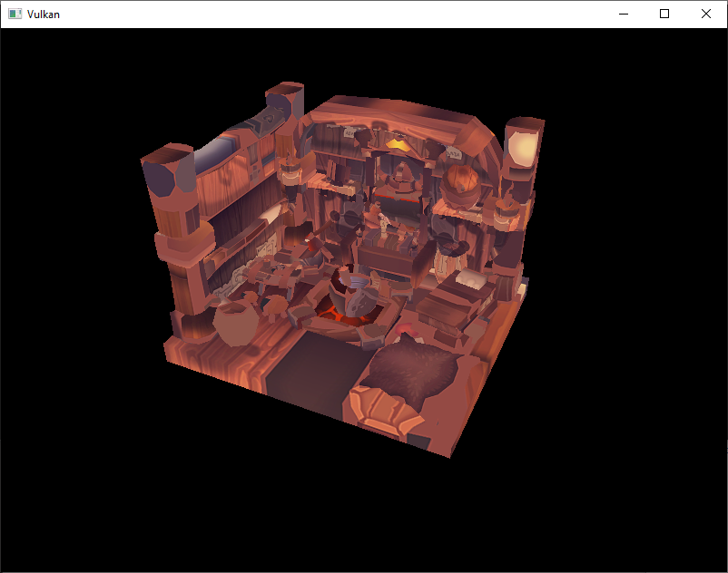

# Loading models
## 简介
许多图像api会写一个自己的`OBJ`加载器。问题是很多应用在不久的将不再支持此格式，比如骨骼动画。本节将加载一个`OBJ`格式的模型，但主要集中在网格数据和程序之间的交互，而不是将精力放在加载文件上。

## 库
这里使用[tinyobjloader](https://github.com/syoyo/tinyobjloader)库从一个`OBJ`文件加载顶点和面。集成此库非常便利，因为和`std_image`一样，是单个文件。到对应链接下载文件`tiny_obj_loader.h`，放到库文件夹下。确保使用master分支的文件，发布版已经过期了。

### Visual Stdio
将文件`tiny_obj_loader.h`加到`Additional Include Directories`路径。


### Makefile
将文件`tiny_obj_loader.h`放到GCC的`include directories`：

```makefile
VULKAN_SDK_PATH = /home/user/VulkanSDK/x.x.x.x/x86_64
STB_INCLUDE_PATH = /home/user/libraries/stb
TINYOBJ_INCLUDE_PATH = /home/user/libraries/tinyobjloader

...

CFLAGS = -std=c++17 -I$(VULKAN_SDK_PATH)/include -I$(STB_INCLUDE_PATH) -I$(TINYOBJ_INCLUDE_PATH)
```

### Macos
放在include文件夹，在build setting 里设置`header include`包含此路径。

## 网格体小样
本章还没有开启光照，这里使用已经将光照信息烘焙到贴图里的网格小样。获取此类3d模型简单方式是去网站[Sketchfab](https://sketchfab.com/)查找。很多模型都是`OBJ`格式，并使用了最宽松的许可。

本章使用了[nigelgoh](https://sketchfab.com/nigelgoh)做的[Viking room](https://sketchfab.com/3d-models/viking-room-a49f1b8e4f5c4ecf9e1fe7d81915ad38)。这里修改了源模型的尺寸和朝向。下载地址如下：

* [viking_room.obj](https://vulkan-tutorial.com/resources/viking_room.obj)
* [viking_room.png](https://vulkan-tutorial.com/resources/viking_room.png)

也可以使用自制的模型，但需要保证只有一种材质，并且尺寸大概是1.5x1.5x1.5单位长度。如果大于此尺寸，就需要修改view矩阵。将model文件放在和`shader，textures`文件夹下同一目录。将texture放入`textures`文件夹。

新添加两个配置变量来定义模型和贴图的路径：

```C++
const uint32_t WIDTH = 800;
const uint32_t HEIGHT = 600;

const std::string MODEL_PATH = "models/viking_room.obj";
const std::string TEXTURE_PATH = "textures/viking_room.png";
```

更新`createTextureImage`使用此路径：

```C++
stbi_uc* pixels = stbi_load(TEXTURE_PATH.c_str(), &texWidth, &texHeight, &texChannels, STBI_rgb_alpha);
```
## 加载顶点和索引
现在需要加载模型文件的顶点和顶点索引，需要移除全局`vertices`和`indices`数组。取而代之的是作为成员变量的非const容器：

```C++
std::vector<Vertex> vertices;
std::vector<uint32_t> indices;
VkBuffer vertexBuffer;
VkDeviceMemory vertexBufferMemory;
```

这里将`indices`的类型从`unit16_t`修改为了`uint32_t`，因为顶点数可能超过65535。同时需要修改`vkCmdBindIndexBuffer`参数。

```C++
vkCmdBindIndexBuffer(commandBuffers[i], indexBuffer, 0, VK_INDEX_TYPE_UINT32);
```

引入tinyobjloader库和包含STB库一样的方式。包含`tiny_obj_loader.h`文件并且定义`TINYOBJLOADER_IMPLEMENTATION`在同一个源文件中来引入定义的函数，避免链接错误：

```C++
#define TINYOBJLOADER_IMPLEMENTATION
#include <tiny_obj_loader.h>
```

现在添加函数`loadModel`，使用库中的方法加载模型的顶点和索引来填充`vertices`和`indices`容器。此函数需要在顶点和索引buffer创建前调用：

```C++
void initVulkan() {
    ...
    loadModel();
    createVertexBuffer();
    createIndexBuffer();
    ...
}

...

void loadModel() {

}
```

通过调用函数`tinyobj::LoadObj`将模型数据加载到库数据结构体：

```C++
void loadModel() {
    tinyobj::attrib_t attrib;
    std::vector<tinyobj::shape_t> shapes;
    std::vector<tinyobj::material_t> materials;
    std::string warn, err;

    if (!tinyobj::LoadObj(&attrib, &shapes, &materials, &warn, &err, MODEL_PATH.c_str())) {
        throw std::runtime_error(warn + err);
    }
}
```

OBJ文件包含位置，法线，texture坐标以及面。面由任意数量的顶点组成，每个顶点通过索引指向位置，法线以及/或贴图坐标。这使得可以复用顶点和独立属性。

在`attrib`成员中，`attrib.vertices`，`attrib.normals`，`attrib.texcoords` 容器分别包含所有顶点，法线和贴图坐标。`shapes`容器包含所有独立物件和它们的面。每个面包含顶点数组，每个顶点包含位置，法线，以及贴图坐标索引。OBJ模型为每个面定义材质和贴图，此处先忽略。

`err`和`warn`字符串分别包含加载模型产生的错误和警告信息，比如丢失材质定义。当`LoadObj`返回`false`时，加载失败。上面提及到在OBJ的面可能包含任意个顶点，但我们的应用只能渲染三角形。幸运的是`LoadObj`有个默认参数自动将面划分为三角形，此参数默认是开启的。

我们将模型中所有的面结合为一个整体，通过遍历所有shapes：
```C++
for (const auto& shape : shapes) {
    for (const auto& index : shape.mesh.indices) {
        Vertex vertex{};
        // index.vertex_index 对应属性顶点数组里的索引，三个坐标x,y,z对应步长为3
        vertex.pos = {
            attrib.vertices[3 * index.vertex_index + 0],
            attrib.vertices[3 * index.vertex_index + 1],
            attrib.vertices[3 * index.vertex_index + 2]
        };

        // index.texcoord_index 对应属性贴图坐标数组里的索引，两个坐标u,v对应步长为2
        vertex.texCoord = {
            attrib.texcoords[2 * index.texcoord_index + 0],
            attrib.texcoords[2 * index.texcoord_index + 1]
        };

        // 颜色使用贴图颜色
        vertex.color = {1.0f, 1.0f, 1.0f};
        vertices.push_back(vertex);
        // 从 0 到 n，对应每个顶点索引
        indices.push_back(indices.size());  
    }
}
```

因为加载模型时，已经将面划分为三角形，因此可以直接加载顶点索引。

运行程序后结果如下：



几何体没问题，但贴图出什么问题了？OBJ格式假定竖向为0时，在坐标系系统中为贴图底部，但是将贴图上传到Vulkan后，0为最顶部的坐标。解决此问题是将竖向的坐标翻转：

```C++
vertex.texCoord = {
    attrib.texcoords[2 * index.texcoord_index + 0],
    1.0f - attrib.texcoords[2 * index.texcoord_index + 1]
};
```

再次运行程序，结果正确。


## 去除重复顶点
不幸的是我们目前没有真正利用索引buffer的优点。`vertices` vector包含大量的重复顶点数据，因为许多顶点被多个三角形共用。因此需要将顶点去重，使用索引buffer来复用三角形共享顶点。最直接的方式是使用`map`或`unorder_map`来存储顶点以及相应的索引：

```C++
#include <unordered_map>

...

std::unordered_map<Vertex, uint32_t> uniqueVertices{};

for (const auto& shape : shapes) {
    for (const auto& index : shape.mesh.indices) {
        Vertex vertex{};

        ...
        // 通过map来出重
        if (uniqueVertices.count(vertex) == 0) {
            uniqueVertices[vertex] = static_cast<uint32_t>(vertices.size());
            vertices.push_back(vertex);
        }

        indices.push_back(uniqueVertices[vertex]);
    }
}
```

使用`Vertex`类型作为字典`key`值，需要实现两个接口：*equality test* 和 *hash calculation* 。前一个方法通过覆盖`Vertex`结构体里的`==`操作符：

```C++
bool operator==(const Vertex& other) const {
    return pos == other.pos && color == other.color && texCoord == other.texCoord;
}
```

`Vertex`的hash函数实现通过标准模板`std::hash<T>`。Hash函数是个复杂的话题，但是[cpprefrence.com](http://en.cppreference.com/w/cpp/utility/hash)建议结合结构体(`Vertex`)的成员字段来实现标准hash函数：

```C++
namespace std {
    template<> struct hash<Vertex> {
        size_t operator()(Vertex const& vertex) const {
            return ((hash<glm::vec3>()(vertex.pos) ^
                   (hash<glm::vec3>()(vertex.color) << 1)) >> 1) ^
                   (hash<glm::vec2>()(vertex.texCoord) << 1);
        }
    };
}
```
这段代码放在`Vertex`结构体外部。对于GLM中类型对应的hash函数需要包含如下头文件：

```C++
// hash 函数定义在gtx文件夹下，说明此项技术是GLM的实验性扩展。因此需要定义宏`GLM_ENABLE_EXPERIMENTAL`来使用此项特性。这意味着新版本的GLM可能会修改API，但实践中API还是非常稳定的。
#define GLM_ENABLE_EXPERIMENTAL
#include <glm/gtx/hash.hpp>
```

现在可以成功编译运行程序，如果检查`vertices`的尺寸，你将会看到大小从1,500,000降到265,645！这意味着每个顶点平均被大约6个三角形共用。实实在在节省了很多GPU显存。

[返回](../README.md)