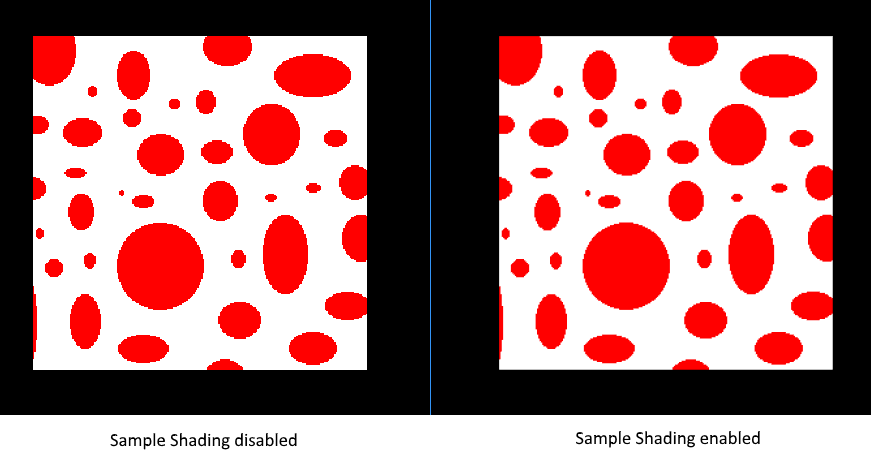

# 多重采样
## 简介
我们的程序现在可以加载*levels of details-LOD*贴图来修复距离观察远端渲染物件产生的*伪影(artifacts)*。图像现在表现的更加平滑，但在近距离观察后，发现在绘制的几何体边缘有锯齿。尤其早期绘制的四边形更加明显。


这种不想要的效果称作*锯齿(aliasing)*，这是因为渲染时，像素的数量是有限的。因为不存在无限度的分辨率，因此在一些屏幕尺寸上总能看到这种效果。有很多修复此问题的方式，这里只探讨流行中的一种：[Multisample anti-aliasing(MSAA)](https://en.wikipedia.org/wiki/Multisample_anti-aliasing)。

通用渲染中，像素的颜色通过在其中心的单个采样点来决定在屏幕上的颜色。如果某条线经过像素但是采样点不被包含在内，此像素将会被忽略，这就导致了锯齿阶梯效果。


MSAA就是单个像素使用多个采样点来获取最终颜色。正如期望的结果，多个采样点带来更好的效果，但是消耗更多的计算。


在我们的实现中，我们将使用最大可使用的采样数。但在实际应用中这并不是最好的实现方式。如果能达到最终效果要求，为了追求更高的性能使用更少的采样数才是更好的选择。

## 获取当前采样数
先来获取硬件硬件支持的最大采样数。大多数现代GPU支持至少8个采样数，但者并不保证所有的GPU都一致。通过新添加一个成员变量来记录采样数：

```C++
VkSampleCountFlagBits msaaSamples = VK_SAMPLE_COUNT_1_BIT;
```

默认每个像素使用一个采样器，这等价于没有使用多重采样，这种情形下最终的图像不会改变。采样器的最大数量通过选择的物理设备关联的`VkPhysicalDeviceProperties`来获取。我们使用了深度buffer，因此要为颜色和深度使用相同的采样器数量。我们将为这两个设置硬件能支持最大的采样数。添加一个函数来获取此值：

```C++
VkSampleCountFlagBits getMaxUsableSampleCount() {
    VkPhysicalDeviceProperties physicalDeviceProperties;
    vkGetPhysicalDeviceProperties(physicalDevice, &physicalDeviceProperties);

    VkSampleCountFlags counts = physicalDeviceProperties.limits.framebufferColorSampleCounts & physicalDeviceProperties.limits.framebufferDepthSampleCounts;
    if (counts & VK_SAMPLE_COUNT_64_BIT) { return VK_SAMPLE_COUNT_64_BIT; }
    if (counts & VK_SAMPLE_COUNT_32_BIT) { return VK_SAMPLE_COUNT_32_BIT; }
    if (counts & VK_SAMPLE_COUNT_16_BIT) { return VK_SAMPLE_COUNT_16_BIT; }
    if (counts & VK_SAMPLE_COUNT_8_BIT) { return VK_SAMPLE_COUNT_8_BIT; }
    if (counts & VK_SAMPLE_COUNT_4_BIT) { return VK_SAMPLE_COUNT_4_BIT; }
    if (counts & VK_SAMPLE_COUNT_2_BIT) { return VK_SAMPLE_COUNT_2_BIT; }

    return VK_SAMPLE_COUNT_1_BIT;
}
```

我们将在物理硬件选择流程时使用此函数设置`msaaSamples`变量。为了此目的，需要修改函数`pickPhysicalDevice`函数：

```C++
void pickPhysicalDevice() {
    ...
    for (const auto& device : devices) {
        if (isDeviceSuitable(device)) {
            physicalDevice = device;
            msaaSamples = getMaxUsableSampleCount();
            break;
        }
    }
    ...
}
```

## 设置render target
在MSAA流程中，每个像素在*离线(offscreen)* buffer中采样，然后渲染到屏幕。这个新的buffer和平常渲染的images不同，此image每个像素需要存储多个采样器。一旦多重采样buffer创建，它需要映射到默认framebuffer(此buffer每个像素存储一个采样器)。这就是为啥要创建额外的render target并且修改当前的渲染流程。我们仅需要一个render target，因为每次绘制只有一个render target是激活的，正如depth buffer。添加如下的成员变量：

```C++
VkImage colorImage;
VkDeviceMemory colorImageMemory;
VkImageView colorImageView;
```

新的image每个像素将存储需要的采样数，因此在image的创建流程需要为`VkImageCreateInfo`传递此值。修改`createImage`函数添加`numSamples`参数：

```C++
void createImage(uint32_t width, uint32_t height, uint32_t mipLevels, VkSampleCountFlagBits numSamples, VkFormat format, VkImageTiling tiling, VkImageUsageFlags usage, VkMemoryPropertyFlags properties, VkImage& image, VkDeviceMemory& imageMemory) {
    ...
    imageInfo.samples = numSamples;
    ...
```

目前为止，使用`VK_SAMPLER_COUNT_1_BIT`更新所有调用此函数的参数，在我们的实现中将会替换会需要的值。

```C++
createImage(swapChainExtent.width, swapChainExtent.height, 1, VK_SAMPLE_COUNT_1_BIT, depthFormat, VK_IMAGE_TILING_OPTIMAL, VK_IMAGE_USAGE_DEPTH_STENCIL_ATTACHMENT_BIT, VK_MEMORY_PROPERTY_DEVICE_LOCAL_BIT, depthImage, depthImageMemory);
...
createImage(texWidth, texHeight, mipLevels, VK_SAMPLE_COUNT_1_BIT, VK_FORMAT_R8G8B8A8_SRGB, VK_IMAGE_TILING_OPTIMAL, VK_IMAGE_USAGE_TRANSFER_SRC_BIT | VK_IMAGE_USAGE_TRANSFER_DST_BIT | VK_IMAGE_USAGE_SAMPLED_BIT, VK_MEMORY_PROPERTY_DEVICE_LOCAL_BIT, textureImage, textureImageMemory);
```

现在创建多重采样颜色buffer。添加`createColorResources`函数并且使用`msaaSamples`当做`createImage`的函数参数。我们只用一个mip level，因为每个像素使用多个采样器，Vulkan说明里这样规定。同时，颜色buffer不需要mipmaps，因为不会被当做贴图使用。

```C++
void createColorResources() {
    VkFormat colorFormat = swapChainImageFormat;

    createImage(swapChainExtent.width, swapChainExtent.height, 1, msaaSamples, colorFormat, VK_IMAGE_TILING_OPTIMAL, VK_IMAGE_USAGE_TRANSIENT_ATTACHMENT_BIT | VK_IMAGE_USAGE_COLOR_ATTACHMENT_BIT, VK_MEMORY_PROPERTY_DEVICE_LOCAL_BIT, colorImage, colorImageMemory);
    colorImageView = createImageView(colorImage, colorFormat, VK_IMAGE_ASPECT_COLOR_BIT, 1);
}
```

为了连续性，在`createDepthResources`之前调用：

```C++
void initVulkan() {
    ...
    createColorResources();
    createDepthResources();
    ...
}
```

现在有了多重采样颜色buffer，是时候处理深度buffer了。修改`createDepthResources`函数，修改深度buffer使用的采样数：

```C++
void createDepthResources() {
    ...
    createImage(swapChainExtent.width, swapChainExtent.height, 1, msaaSamples, depthFormat, VK_IMAGE_TILING_OPTIMAL, VK_IMAGE_USAGE_DEPTH_STENCIL_ATTACHMENT_BIT, VK_MEMORY_PROPERTY_DEVICE_LOCAL_BIT, depthImage, depthImageMemory);
    ...
}
```

现在创建了新的多个Vulkan资源，所以在合适的地方需要释放它们：

```C++
void cleanupSwapChain() {
    vkDestroyImageView(device, colorImageView, nullptr);
    vkDestroyImage(device, colorImage, nullptr);
    vkFreeMemory(device, colorImageMemory, nullptr);
    ...
}
```

当窗口改变大小时，更新`recreateSwapChain`来让颜色image使用正确的分辨率重新创建：

```C++
void recreateSwapChain() {
    ...
    createGraphicsPipeline();
    createColorResources();
    createDepthResources();
    ...
}
```

使用了新的MSAA设置后，当前图形管线中将使用新的资源，framebuffer，render pass！
## 添加新的attachments
首先来看render pass。修改`createRenderPass`，更新颜色和深度附件创建结构体信息：

```C++
void createRenderPass() {
    ...
    colorAttachment.samples = msaaSamples;
    colorAttachment.finalLayout = VK_IMAGE_LAYOUT_COLOR_ATTACHMENT_OPTIMAL;
    ...
    depthAttachment.samples = msaaSamples;
    ...
```

这里需要注意的是我们将`finalLayout`从`VK_IMAGE_LAYOUT_PRESENT_SRC_KHR`改为`VK_IMAGE_LAYOUT_COLOR_ATTACHMENT_OPTIMAL`。这是因为多重采样images不能直接呈现。首先需要修改为普通image。这项修改不需要用在深度buffer上，因为它永远不需要呈现。因为我们将为颜色buffer添加称作*resolve attachment*新的附件：

```C++
    ...
    VkAttachmentDescription colorAttachmentResolve{};
    colorAttachmentResolve.format = swapChainImageFormat;
    colorAttachmentResolve.samples = VK_SAMPLE_COUNT_1_BIT;
    colorAttachmentResolve.loadOp = VK_ATTACHMENT_LOAD_OP_DONT_CARE;
    colorAttachmentResolve.storeOp = VK_ATTACHMENT_STORE_OP_STORE;
    colorAttachmentResolve.stencilLoadOp = VK_ATTACHMENT_LOAD_OP_DONT_CARE;
    colorAttachmentResolve.stencilStoreOp = VK_ATTACHMENT_STORE_OP_DONT_CARE;
    colorAttachmentResolve.initialLayout = VK_IMAGE_LAYOUT_UNDEFINED;
    colorAttachmentResolve.finalLayout = VK_IMAGE_LAYOUT_PRESENT_SRC_KHR;
    ...
```

render pass当前需要将多重采样颜色image处理为*regular*附件。新建附件引用指向用来当做呈现目标的颜色buffer：

```C++
    ...
    VkAttachmentReference colorAttachmentResolveRef{};
    colorAttachmentResolveRef.attachment = 2;
    colorAttachmentResolveRef.layout = VK_IMAGE_LAYOUT_COLOR_ATTACHMENT_OPTIMAL;
    ...
```

设置subpass结构体成员`pResolveAttachments`新创建的附件引用。这足以让render pass定义一个多重采样处理操作来将image渲染到屏幕：

```C++
    ...
    subpass.pResolveAttachments = &colorAttachmentResolveRef;
    ...
```

现在使用新的颜色附件更新render pass信息结构体：

```C++
    ...
    std::array<VkAttachmentDescription, 3> attachments = {colorAttachment, depthAttachment, colorAttachmentResolve};
    ...
```

搞定了render pass后，修改`createFrameBuffers`，并且添加新的image view到列表：

```C++
void createFrameBuffers() {
        ...
        std::array<VkImageView, 3> attachments = {
            colorImageView,
            depthImageView,
            swapChainImageViews[i]
        };
        ...
}
```

最后通过修改`createGraphicsPipeline`来通知新创建的管线使用多重采样：

```C++
void createGraphicsPipeline() {
    ...
    multisampling.rasterizationSamples = msaaSamples;
    ...
}
```

运行程序，看到如下结果：


和mipmapping一样，看不到明显的区别。近距离仔细观察，将会发现边缘的锯齿没有那么明显，整个image相比源image更加光滑。


当近距离观察一个边时，差别更加明显：


## 改善质量
当前的MSAA实现有一些限制，在有更多细节的场景里将会影响输出图像的质量。比如当前没有解决shader锯齿的潜在问题，比如MSAA只平滑了几何体的边缘但没有解决平滑内部填充。这会导致平滑的多边形渲染在屏幕上，但是如果是高对比度的贴图，将会看到贴图的锯齿。一种解决此问题的方式是开启[Sample Shading](https://www.khronos.org/registry/vulkan/specs/1.0/html/vkspec.html#primsrast-sampleshading)，这将非常多的提升渲染图像质量，虽说增加了额外的性能开销：

```C++
void createLogicalDevice() {
    ...
    deviceFeatures.sampleRateShading = VK_TRUE; // enable sample shading feature for the device
    ...
}

void createGraphicsPipeline() {
    ...
    multisampling.sampleShadingEnable = VK_TRUE; // enable sample shading in the pipeline
    multisampling.minSampleShading = .2f; // min fraction for sample shading; closer to one is smoother
    ...
}
```

我们当前的例子没有开启Sample Shading，但一些情境下质量的提升非常明显：



## 结论
到这里需要做很多的工作，但当前获得了关于Vulkan很好的基础。现在拥有的Vulkan知识足够让你探索更多的特性：

* Push constants
* Instanced rendering
* Dynamic uniforms
* Separete images and sampler descriptors
* Pipeline cache
* Multi-threaded command buffer generation
* Multiple subpasses
* Computer shaders

当前程序可以使用多种方式扩展，比如添加*Blinn-Phong*光照，后处理效果和shadow mapping。你应当能从别的API教程中学到这些效果运行的原理，因为出去Vulkan的不同，许多概念是共通的。


[返回](../README.md)